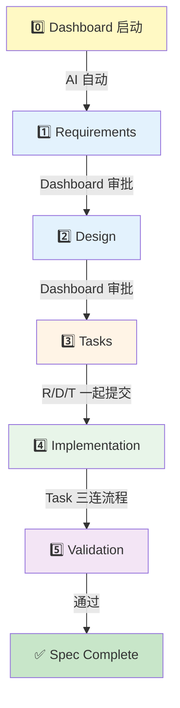

# Spec-Workflow 工作流指南

**版本**: v2.0
**最后更新**: 2025-11-19
**适用范围**: 所有使用 spec-workflow 的功能开发和重构

**v2.0 更新内容**:
- ✅ 明确 Git 提交策略（R/D/T 一起提交 + Task 按原子性独立提交）
- ✅ 添加 Task 三连流程（更新 tasks.md + git commit + TodoWrite）
- ✅ Dashboard 自动启动说明

---

## 📚 目录

1. [概述](#概述)
2. [基本流程](#基本流程)
3. [任务管理系统](#任务管理系统)
4. [Commit 规范](#commit-规范)
5. [Phase 级检查点](#phase-级检查点)
6. [常见错误](#常见错误)
7. [最佳实践](#最佳实践)

---

## 概述

Spec-workflow 是一个结构化的功能开发流程，确保：
- ✅ 需求明确、设计完善后再实施
- ✅ 任务拆解合理、进度可追踪
- ✅ 实施过程有文档记录、可复盘

**核心理念**: Requirements → Design → Tasks → Implementation → Validation

---

## 基本流程

### Dashboard 自动启动

**AI 在开始 spec 时会自动启动 dashboard**：

```bash
# AI 在调用 spec-workflow-guide 前自动执行
npx -y @pimzino/spec-workflow-mcp@latest --dashboard
# 后台运行，不阻塞 AI 工作流
```

**你只需要**：
- 打开浏览器访问 `http://localhost:3000`
- 在 dashboard 中审批 Requirements/Design/Tasks
- 无需记住启动命令

### 完整生命周期



### 各阶段职责

| 阶段 | 产出物 | 审批要求 | 工具 |
|------|--------|---------|------|
| **Requirements** | `requirements.md` | Dashboard 审批 | `mcp__spec-workflow__spec-workflow-guide` |
| **Design** | `design.md` | Dashboard 审批 | 同上 |
| **Tasks** | `tasks.md` | 自动生成 | 同上 |
| **Implementation** | Code + Commits | Git commits | 见 Commit 规范 |
| **Validation** | 测试结果 | 自行验证 | 见 Phase 检查点 |

---

## Git 提交策略

### 核心原则：原子性 + 可追溯性

**规则**：
- **R/D/T 文档**：审批通过后**一起提交**（原子性）
- **Task 代码**：按**功能原子性**独立提交（每个 task 一个 commit）
- **tasks.md 状态**：与代码**同步提交**（never out of sync）

### 标准提交序列

```bash
# Step 1: R/D/T 文档审批通过后一起提交
git add .spec-workflow/specs/<spec-name>/requirements.md
git add .spec-workflow/specs/<spec-name>/design.md
git add .spec-workflow/specs/<spec-name>/tasks.md
git commit -m "feat(spec/<spec-name>): add requirements, design, and tasks

Complete R/D/T documentation for <spec-name> spec.

🤖 Generated with [Claude Code](https://claude.com/claude-code)
Co-Authored-By: Claude <noreply@anthropic.com>"

# Step 2: 每个 task 完成后立即提交（代码 + tasks.md 状态更新）
# 使用"Task 三连流程"（见下文）

# Step 3: 所有 task 完成后记录 implementation logs
git commit -m "docs(spec/<spec-name>): add implementation logs"
```

### 理由

- ✅ **R/D/T 原子性**：计划要么都有要么都没有（避免部分文档丢失）
- ✅ **Task 可追溯**：每个 commit 对应一个逻辑单元（history 清晰）
- ✅ **状态同步**：tasks.md 永远与代码一致（dashboard 准确）
- ✅ **遵循 Rule 1**：单次变更原则（每个 commit 只做一件事）

---

## 任务管理系统

### 🔑 核心理解：两层独立系统

Spec-workflow 使用 **两个独立的任务追踪系统**，各有不同职责：

```
┌─────────────────────────────────────────────────────────┐
│ 两层任务管理                                              │
├─────────────────────────────────────────────────────────┤
│                                                         │
│ 🔄 Layer 1: TodoWrite (会话级临时追踪)                    │
│    - 用途: 开发中的进度追踪、任务拆解                        │
│    - 生命周期: 当前对话 session                            │
│    - 持久化: ❌ compact 后丢失                             │
│    - 工具: Claude Code 的 TodoWrite tool                │
│    - 示例:                                               │
│      ✓ 正在实现 extractKeywords 函数                     │
│      ✓ 已完成单元测试                                     │
│      ✓ 待重构 processData 逻辑                           │
│                                                         │
│ 📋 Layer 2: tasks.md (项目级持久追踪)                     │
│    - 用途: Spec 任务状态管理、Dashboard 显示               │
│    - 生命周期: 项目全生命周期                              │
│    - 持久化: ✅ Git 版本控制                               │
│    - 工具: Markdown 文件，手动更新                         │
│    - 格式: [ ] pending → [x] completed                  │
│    - Dashboard: 读取此文件显示进度                         │
│                                                         │
└─────────────────────────────────────────────────────────┘
```

### 🚨 关键区别

| 特性 | TodoWrite | tasks.md |
|------|-----------|----------|
| **谁看** | AI 自己（当前对话） | Dashboard + 人类（项目全局） |
| **谁更新** | AI 自动（通过 TodoWrite tool） | **人类/AI 手动**（Edit 工具） |
| **何时更新** | 开发过程中随时 | **任务完成后立即** |
| **持久化** | ❌ 会话结束后丢失 | ✅ Git 永久保存 |
| **用途** | 临时进度、思路拆解 | 正式进度追踪 |

### ⚠️ 常见误区

❌ **错误认知**：更新了 TodoWrite 就完成了任务追踪
✅ **正确理解**：TodoWrite 只是开发辅助，**tasks.md 才是正式记录**

❌ **错误行为**：任务完成后只标记 TodoWrite，不更新 tasks.md
✅ **正确行为**：任务完成后**必须**更新 tasks.md 状态为 `[x]`

### 🔄 Task 三连流程（强制执行）

**每个 task 完成后必须立即执行以下三步**：

```markdown
1️⃣ 更新 tasks.md 状态为 [x]
   - 使用 Edit 工具修改 .spec-workflow/specs/<spec-name>/tasks.md
   - 将对应 task 的 [ ] 改为 [x]

2️⃣ Git commit（代码 + tasks.md 一起提交）
   - git add <modified-files>
   - git add .spec-workflow/specs/<spec-name>/tasks.md
   - git commit -m "type(scope): description (Task X.Y)"

3️⃣ TodoWrite 标记 completed
   - 更新 TodoWrite 状态（AI 内部追踪）
   - 确保两层系统同步
```

**关键保证**：
- ✅ 代码和状态**原子化提交**（never out of sync）
- ✅ 遵循 "Rule 2: 失败立即停止"（测试失败可精确回滚）
- ✅ Git history 成为精确的进度追踪器

### 📖 典型工作流示例

```markdown
## 场景：实施 Task 1.1 - 创建 TECHNICAL_DECISIONS.md

### Step 1: 开始任务（TodoWrite 标记 in_progress）
AI 使用 TodoWrite 创建临时任务清单：
- [ ] 读取 CLAUDE.md lines 595-641
- [ ] 提取技术决策内容
- [ ] 按 decision record 模板组织
- [ ] 创建 docs/TECHNICAL_DECISIONS.md
- [ ] 验证所有决策已记录

### Step 2: 开发过程（更新 TodoWrite）
AI 边开发边更新：
- [x] 读取 CLAUDE.md lines 595-641
- [x] 提取技术决策内容
- [x] 按 decision record 模板组织
- [x] 创建 docs/TECHNICAL_DECISIONS.md
- [x] 验证所有决策已记录

### Step 3: Task 三连流程（关键！）

**3.1 更新 tasks.md 状态**
📝 Edit .spec-workflow/specs/<spec-name>/tasks.md:
- [ ] 1.1 Create TECHNICAL_DECISIONS.md  → - [x] 1.1 Create TECHNICAL_DECISIONS.md

**3.2 Git commit（代码 + tasks.md 一起）**
git add docs/TECHNICAL_DECISIONS.md
git add .spec-workflow/specs/<spec-name>/tasks.md
git commit -m "docs(tech-decisions): create TECHNICAL_DECISIONS.md (Task 1.1)

Created comprehensive technical decisions log with 4 key decisions:
- Decision 1: Monorepo structure
- Decision 2: Versioned configurations
- Decision 3: Immutable run bundles
- Decision 4: Four-stage processing pipeline

Extracted from CLAUDE.md lines 595-641 following design.md template.

Updated tasks.md status: Task 1.1 [x] completed.

🤖 Generated with [Claude Code](https://claude.com/claude-code)
Co-Authored-By: Claude <noreply@anthropic.com>"

**3.3 TodoWrite 标记 completed**
（AI 内部更新，确保两层系统同步）

### Step 4: 运行测试验证（如适用）
- 如果有测试，立即运行
- 成功 → 进入下一个 task
- 失败 → 立即回滚此 commit，分析原因
```

---

## Commit 规范

### 基本原则（方案 A：明确化版本）

**每个 task 完成后必须遵循以下步骤**：

```markdown
1️⃣ 小步 commit 开发
   - 遵循 Git 最佳实践
   - 每个逻辑单元一个 commit
   - Commit message 清晰描述变更

2️⃣ Commit message 标记 task ID
   - 格式: "type(scope): description (Task X.Y)"
   - 示例: "feat(docs): create RELEASE_WORKFLOW.md (Task 1.2)"
   - 目的: 可追溯任务到具体代码变更

3️⃣ **完成任务后立即更新 tasks.md 状态** ⬅️ 新增明确要求
   - 必须: 将 tasks.md 中对应任务标记从 [ ] 改为 [x]
   - 时机: 任务代码 commit 后立即执行
   - 方式: 使用 Edit 工具修改 tasks.md
   - 提交: 可独立 commit 或合并到 task 完成 commit

4️⃣ （可选）使用 log-implementation 记录详细实施日志
   - 适用场景: 复杂实施需要详细记录时
   - 工具: mcp__spec-workflow__log-implementation
   - 内容: artifacts (APIs, components, functions, classes, integrations)
```

### Commit Message 模板

```bash
# 单个 task 完成
git commit -m "type(scope): description (Task X.Y)

[详细说明]

🤖 Generated with [Claude Code](https://claude.com/claude-code)
Co-Authored-By: Claude <noreply@anthropic.com>"

# 多个 task 合并（同一类型）
git commit -m "type(scope): description (Task X.Y-X.Z)

[详细说明，列出每个 task]

🤖 Generated with [Claude Code](https://claude.com/claude-code)
Co-Authored-By: Claude <noreply@anthropic.com>"

# tasks.md 状态更新（独立 commit）
git commit -m "chore(spec): update Task X.Y status to completed

Task X.Y has been implemented and committed. Updating tasks.md status
marker from [ ] to [x] for dashboard tracking.

🤖 Generated with [Claude Code](https://claude.com/claude-code)
Co-Authored-By: Claude <noreply@anthropic.com>"
```

### 示例对比

#### ❌ 错误示例（忘记更新 tasks.md）

```bash
# 实施了 Task 1.1, 1.2, 1.3
git log --oneline -3
b6cd8a23 docs(tech-decisions): create TECHNICAL_DECISIONS.md (Task 1.1)
0f527829 docs(workflow): create RELEASE_WORKFLOW.md (Task 1.2)
07728108 docs(status): enhance PROJECT_STATUS.md (Task 1.3)

# tasks.md 仍然全是 [ ] pending
# Dashboard 显示: 0% 完成
# 问题: 代码完成了，但正式追踪系统不知道！
```

#### ✅ 正确示例（及时更新 tasks.md）

```bash
# Phase 1 完成后立即更新
git log --oneline -4
07728108 docs(status): enhance PROJECT_STATUS.md (Task 1.3)
0f527829 docs(workflow): create RELEASE_WORKFLOW.md (Task 1.2)
b6cd8a23 docs(tech-decisions): create TECHNICAL_DECISIONS.md (Task 1.1)
8a9b3c1d chore(spec): update Phase 1 tasks status to completed

# tasks.md 中 Task 1.1, 1.2, 1.3 都标记为 [x]
# Dashboard 显示: Phase 1 完成 (3/3)
# 成功: 代码和追踪系统同步！
```

---

## Phase 级检查点

### 原则（方案 C：强制检查点）

**每个 Phase 完成后必须执行以下检查**：

```markdown
## Phase X 完成检查清单

### 1️⃣ 代码验证
- [ ] 该 Phase 所有任务的代码已实施
- [ ] 所有代码已提交到 Git
- [ ] Commit message 包含 task ID
- [ ] 代码通过基本测试（如适用）

### 2️⃣ tasks.md 状态更新
- [ ] tasks.md 中该 Phase 所有任务状态已更新为 [x]
- [ ] 状态更新已提交到 Git
- [ ] 验证: grep -c '^\- \[x\] X\.' tasks.md（计数正确）

### 3️⃣ Dashboard 验证
- [ ] 打开 spec-workflow dashboard
- [ ] 确认该 Phase 显示为"已完成"
- [ ] 确认进度百分比正确

### 4️⃣ 文档完整性
- [ ] 如有新建文件，已添加到 Git
- [ ] 如有修改文档，变更已提交
- [ ] 相关链接和引用已更新
```

### 检查工具

```bash
# 检查 Phase 1 任务完成情况
grep '^\- \[.\] 1\.' .spec-workflow/specs/*/tasks.md

# 计数已完成任务
grep -c '^\- \[x\] 1\.' .spec-workflow/specs/*/tasks.md

# 查看最近 commits 是否包含 task ID
git log --oneline -10 | grep -i "task"

# 验证 tasks.md 是否被跟踪
git ls-files .spec-workflow/specs/*/tasks.md
```

### Phase 完成 Commit 模板

```bash
# Phase 完成后的综合 commit（如果有遗漏更新）
git commit -m "chore(spec/spec-name): complete Phase X implementation

All Phase X tasks (X.1 to X.Y) have been implemented and committed.
Updated tasks.md status markers to reflect completion.

**Completed Tasks**:
- [x] X.1: [task description]
- [x] X.2: [task description]
- [x] X.Y: [task description]

**Related Commits**:
- abc1234: Task X.1 implementation
- def5678: Task X.2 implementation
- ghi9012: Task X.Y implementation

Dashboard should now show Phase X as complete.

🤖 Generated with [Claude Code](https://claude.com/claude-code)
Co-Authored-By: Claude <noreply@anthropic.com>"
```

---

## 常见错误

### 错误 1: 混淆 TodoWrite 和 tasks.md

**症状**:
- AI 更新了 TodoWrite，认为任务完成
- tasks.md 仍然显示 [ ] pending
- Dashboard 不显示进度

**原因**:
- 不理解两层系统的区别
- 以为 TodoWrite 会自动同步到 tasks.md

**解决**:
- 理解 TodoWrite = 临时，tasks.md = 正式
- **任务完成后必须手动更新 tasks.md**

**预防**:
- 在 commit 前检查 tasks.md 状态
- 使用 Phase 级检查点强制验证

---

### 错误 2: 忘记提交 spec 文档

**症状**:
- requirements.md, design.md, tasks.md 显示为 untracked
- 实施代码已提交，但 spec 文档未入库
- Git 历史不完整

**原因**:
- 只关注实施代码，忽略 spec 文档本身
- 误以为 spec 文档是临时产物

**解决**:
```bash
# 检查 spec 文档状态
git status .spec-workflow/specs/*/

# 一起提交 spec 文档
git add .spec-workflow/specs/spec-name/
git commit -m "docs(spec/spec-name): add complete spec documentation"
```

**预防**:
- Spec 实施完成后，检查 .spec-workflow/specs/ 目录
- 确保 requirements.md, design.md, tasks.md 都已入库

---

### 错误 3: 批量更新 tasks.md（不及时）

**症状**:
- 完成多个 tasks 后才一次性更新 tasks.md
- 中间状态无法在 Dashboard 看到
- 如果出错，难以定位哪个 task 有问题

**原因**:
- 为了"省事"批量更新
- 不理解及时更新的价值

**解决**:
- 遵循"完成一个 task，立即更新 tasks.md"原则
- 或至少在每个 Phase 完成后更新

**预防**:
- 使用 Phase 级检查点
- 养成"task commit → tasks.md update"的习惯

---

### 错误 4: Commit message 缺少 task ID

**症状**:
- Commit message 只有描述，没有 task ID
- 无法追溯代码变更对应哪个 task
- Implementation Log 无法反向记录

**原因**:
- 忘记添加 task ID
- 不理解 task ID 的追溯价值

**解决**:
```bash
# 检查最近 commits 的 task ID
git log --oneline -10

# 如果遗漏，可以 amend（仅限最新 commit）
git commit --amend -m "type(scope): description (Task X.Y)
..."
```

**预防**:
- 使用 commit message 模板
- Commit 前检查是否包含 task ID

---

## 最佳实践

### 1. 及时同步两层系统

```markdown
**开发中**: 使用 TodoWrite 拆解任务、追踪进度
**完成后**: 立即更新 tasks.md 状态

理想节奏:
- 完成 Task X.Y 的代码
- Git commit (包含 Task X.Y)
- Edit tasks.md (标记 Task X.Y 为 [x])
- Git commit tasks.md 更新（或合并到上一步）
```

### 2. Phase 级检查强制执行

```markdown
**Phase 1 完成后**:
1. 验证所有 Task 1.x 代码已提交
2. 更新所有 Task 1.x 状态为 [x]
3. 提交 tasks.md 更新
4. 检查 Dashboard 显示

**然后才开始 Phase 2**
```

### 3. 使用 Git 别名简化检查

```bash
# 添加到 ~/.gitconfig
[alias]
    spec-status = "!f() { \
        echo '=== Spec Tasks Status ==='; \
        grep '^- \\[.\\]' .spec-workflow/specs/*/tasks.md | head -20; \
        echo ''; \
        echo '=== Pending: '$(grep -c '^- \\[ \\]' .spec-workflow/specs/*/tasks.md); \
        echo '=== Completed: '$(grep -c '^- \\[x\\]' .spec-workflow/specs/*/tasks.md); \
    }; f"

    spec-check = "!git status .spec-workflow/specs/"

# 使用
git spec-status   # 查看任务状态
git spec-check    # 检查 spec 文档是否 tracked
```

### 4. Commit Message 模板

创建 `.gitmessage` 模板：

```bash
# ~/.gitmessage
# type(scope): description (Task X.Y)
#
# [详细说明]
#
# 🤖 Generated with [Claude Code](https://claude.com/claude-code)
# Co-Authored-By: Claude <noreply@anthropic.com>

# 配置 Git 使用模板
git config --global commit.template ~/.gitmessage
```

### 5. Dashboard 即时验证

```markdown
**每个 Phase 完成后**:
- 打开 spec-workflow dashboard
- 刷新页面
- 确认进度显示正确

**如果不正确**:
- 检查 tasks.md 格式是否正确
- 检查 tasks.md 是否已提交
- 检查 Dashboard 是否缓存（刷新）
```

---

## 总结

### 🎯 核心要点

1. **两层系统**: TodoWrite (临时) + tasks.md (正式)
2. **及时更新**: 完成 task → 立即更新 tasks.md
3. **Phase 检查**: 每个 Phase 结束强制验证
4. **Task ID**: Commit message 必须包含
5. **Spec 文档**: requirements/design/tasks 都要入库

### ✅ 成功标准

一个 spec 实施成功的标志：
- ✅ 所有 tasks.md 任务标记为 [x]
- ✅ Dashboard 显示 100% 完成
- ✅ 每个 task 都有对应的 git commit (包含 task ID)
- ✅ requirements.md, design.md, tasks.md 都已入库
- ✅ 实施日志（如有）记录完整

### 🔗 相关文档

- **Spec Workflow 完整指南**: 调用 `mcp__spec-workflow__spec-workflow-guide`
- **版本发布流程**: `analysis/docs-flow-automation/RELEASE_WORKFLOW.md`
- **项目状态**: `docs/PROJECT_STATUS.md`

---

**最后更新**: 2025-11-19
**维护者**: Project Team
**反馈**: 如发现流程问题或有改进建议，请在项目 issue 中讨论
