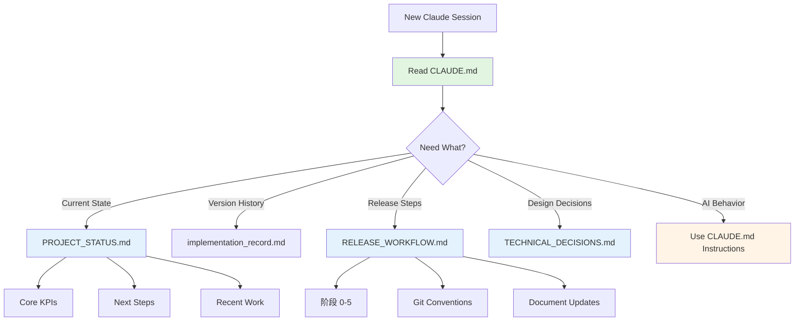

# Design Document

## Overview

This refactoring separates CLAUDE.md into two distinct concerns:
1. **CLAUDE.md** - AI behavioral meta-instructions only (~200-300 lines)
2. **docs/** - Project-specific state data and detailed workflows

The design follows the "Good Taste" principle: eliminate the special case of "project data embedded in AI instructions" by creating a single source of truth for each type of information.

**Target Structure**:
```
CLAUDE.md (300 lines)           docs/
├─ Role Definition              ├─ PROJECT_STATUS.md (current state)
├─ 3 Mandatory Rules            ├─ TECHNICAL_DECISIONS.md (new)
├─ Tool Usage Guide             └─ Quick Start Guide (navigation hub)
├─ Architecture Principles
├─ Navigation Pointers          analysis/
└─ Troubleshooting Summary      └─ docs-flow-automation/
                                    ├─ RELEASE_WORKFLOW.md (new)
                                    └─ GIT_INTEGRATION_GUIDE.md (exists)
```

## Code Reuse Analysis

### Existing Components to Leverage

- **PROJECT_STATUS.md**: Already contains current KPIs, version history table, and next steps
  - Will become the canonical source for "快速状态恢复" data
  - Current structure already supports most needed information

- **implementation_record.md**: Complete version history with technical insights
  - Already serves as detailed version changelog
  - No changes needed

- **analysis/docs-flow-automation/**: Automation documentation
  - GIT_INTEGRATION_GUIDE.md exists and is comprehensive
  - Will add RELEASE_WORKFLOW.md to consolidate workflow details

### Integration Points

- **docs-flow automation scripts**: `scripts/update-docs.js`
  - Currently updates CLAUDE.md "快速状态恢复" section
  - Will be modified to update navigation pointer in CLAUDE.md instead
  - Actual data updates go to PROJECT_STATUS.md only

- **spec-workflow**: Integration already documented
  - CLAUDE.md reference to spec-workflow will remain (tool usage section)
  - No changes needed to spec-workflow itself

## Architecture

### Modular Design Principles

**Single File Responsibility**:
- **CLAUDE.md**: How Claude Code should behave (static instructions)
- **PROJECT_STATUS.md**: What is the current state (dynamic data)
- **RELEASE_WORKFLOW.md**: How to execute releases (static process)
- **TECHNICAL_DECISIONS.md**: Why we made design choices (historical record)

**Component Isolation**:
- AI instructions isolated from project state
- Workflows isolated from quick-start navigation
- Technical decisions isolated from current status

**Clear Interfaces**:
- CLAUDE.md provides navigation pointers with consistent format:
  ```markdown
  **Quick Start**: Read `docs/PROJECT_STATUS.md` for current project state
  **Release Process**: See `analysis/docs-flow-automation/RELEASE_WORKFLOW.md`
  **Technical Decisions**: Check `docs/TECHNICAL_DECISIONS.md`
  ```

### Architecture Diagram



## Components and Interfaces

### Component 1: Simplified CLAUDE.md

**Purpose**: Provide AI behavioral instructions and navigation to detailed documentation

**Structure** (~300 lines):
```markdown
1. Role Definition (~80 lines)
   - Linus Torvalds persona
   - 4 core philosophies
   - Communication principles
   - 5-layer thinking framework

2. Mandatory Rules (~30 lines)
   - Rule 1: Single-change principle
   - Rule 2: Fail-stop
   - Rule 3: Context budget

3. Quick Navigation (~40 lines)
   - Pointer to PROJECT_STATUS.md
   - Pointer to RELEASE_WORKFLOW.md
   - Pointer to TECHNICAL_DECISIONS.md
   - 3-step recovery process (simplified)

4. Tool Usage (~50 lines)
   - spec-workflow guide
   - docs-flow automation
   - MCP tools overview

5. Architecture Principles (~60 lines)
   - Monorepo philosophy
   - Data flow overview
   - Design constraints (high-level)

6. Development Quick Ref (~40 lines)
   - Key commands
   - Code style
   - Critical conventions
```

**Interfaces**: Human-readable markdown consumed by Claude Code on session start

**Dependencies**: None (standalone)

**Reuses**: Existing role definition, rules, and architectural principles from current CLAUDE.md

---

### Component 2: Enhanced PROJECT_STATUS.md

**Purpose**: Centralized project state dashboard (already exists, will enhance navigation section)

**Additions**:
```markdown
## Quick Start for New Sessions

**Step 1: Read This File**
- Current KPIs, recent work, next steps all here

**Step 2: Check Related Docs**
- Version history → `implementation_record.md`
- Release process → `analysis/docs-flow-automation/RELEASE_WORKFLOW.md`
- Technical decisions → `TECHNICAL_DECISIONS.md`

**Step 3: Verify Environment**
[existing verification checklist]
```

**Interfaces**: Human-readable dashboard

**Dependencies**: None

**Reuses**: Existing PROJECT_STATUS.md structure

---

### Component 3: New RELEASE_WORKFLOW.md

**Purpose**: Document complete version release workflow extracted from CLAUDE.md

**Location**: `analysis/docs-flow-automation/RELEASE_WORKFLOW.md`

**Structure**:
```markdown
# Version Release Workflow

## Overview
[Brief intro]

## 阶段 0: 版本规划
[extracted from CLAUDE.md lines 202-217]

## 阶段 0.5: 提交规划文档
[extracted from CLAUDE.md lines 246-274]

## 阶段 1: 代码实施
[extracted from CLAUDE.md lines 276-341]

## 阶段 2: 完整测试
[extracted from CLAUDE.md lines 343-358]

## 阶段 3: 文档更新
[extracted from CLAUDE.md lines 360-442]

## 阶段 4: Git 提交
[extracted from CLAUDE.md lines 444-497]

## 阶段 5: 更新 CLAUDE.md
[modified to: 更新 PROJECT_STATUS.md]

## Checklist
[extracted from CLAUDE.md lines 559-593]

## 常见遗漏提醒
[extracted from CLAUDE.md lines 595-621]
```

**Interfaces**: Step-by-step process guide

**Dependencies**: References to PROJECT_STATUS.md, implementation_record.md

**Reuses**: Entire workflow section from current CLAUDE.md (lines 198-621)

---

### Component 4: New TECHNICAL_DECISIONS.md

**Purpose**: Historical record of key technical decisions

**Location**: `docs/TECHNICAL_DECISIONS.md`

**Structure**:
```markdown
# Technical Decisions Log

## Decision 1: Monorepo Structure
**Date**: [project start]
**Context**: [why we chose monorepo]
**Decision**: Two-project, one-truth philosophy
**Consequences**: [from current CLAUDE.md lines 595-604]

## Decision 2: Versioned Configurations
**Date**: [when implemented]
**Context**: Need immutable config history
**Decision**: configs/vX.Y.Z/<sha>/ structure
**Consequences**: [from CLAUDE.md lines 606-617]

## Decision 3: Immutable Run Bundles
**Date**: [when implemented]
**Context**: Reproducibility requirements
**Decision**: runs/ folder structure
**Consequences**: [from CLAUDE.md lines 618-641]

[Future decisions added here]
```

**Interfaces**: Decision record template

**Dependencies**: None

**Reuses**: "关键设计约束" and "注意事项" from CLAUDE.md

## Data Models

### Navigation Pointer Model
```markdown
**[Category]**: [1-sentence description]
- Read: `[file_path]`
- Purpose: [what you'll find there]
```

Example:
```markdown
**Current Project State**: Latest KPIs, recent work, and next steps
- Read: `docs/PROJECT_STATUS.md`
- Purpose: Understand where the project is right now
```

### Workflow Reference Model
```markdown
## [Workflow Name]

**Quick Summary**: [3-5 bullet points]

**Detailed Guide**: See `[file_path]`
```

Example:
```markdown
## Version Release Workflow

**Quick Summary**:
1. Plan (create vX.Y.Z_plan.md)
2. Implement (code + test)
3. Document (update 3 docs)
4. Commit (git with spec reference)
5. Update status (PROJECT_STATUS.md)

**Detailed Guide**: See `analysis/docs-flow-automation/RELEASE_WORKFLOW.md`
```

## Error Handling

### Error Scenarios

1. **Scenario: Broken navigation links after refactoring**
   - **Handling**: Validation script to check all markdown links
   - **User Impact**: Claude Code fails to find referenced docs → asks user for clarification

2. **Scenario: docs-flow automation breaks after CLAUDE.md changes**
   - **Handling**: Update scripts/update-docs.js to target new structure
   - **User Impact**: Automation fails → manual doc updates required until fixed

3. **Scenario: External tools referencing old CLAUDE.md sections**
   - **Handling**: Add redirect comments in CLAUDE.md for major removed sections
   - **User Impact**: Tools need minor updates to new paths

## Testing Strategy

### Unit Testing

Not applicable (documentation refactoring)

### Integration Testing

**Manual Verification Checklist**:
1. Read new CLAUDE.md from start to finish → verify completeness of AI instructions
2. Follow each navigation pointer → verify all links work
3. Search for "CLAUDE.md" in all docs → update references to new locations
4. Run `npm run update-docs` → verify automation still works
5. Simulate new session recovery → verify 3-step process is clear

### End-to-End Testing

**User Scenario 1: New Session Startup**
1. Claude Code reads CLAUDE.md (~300 lines)
2. Follows pointer to PROJECT_STATUS.md
3. Understands current state within 30 seconds
4. **Expected**: Context consumption reduced by 65%, no information missing

**User Scenario 2: Version Release**
1. User asks Claude to release v0.1.8
2. Claude reads brief summary in CLAUDE.md
3. Follows pointer to RELEASE_WORKFLOW.md
4. Executes all 6 phases correctly
5. **Expected**: Zero process steps missed, all docs updated

**User Scenario 3: Technical Decision Lookup**
1. Claude needs to understand why configs are immutable
2. Follows CLAUDE.md pointer to TECHNICAL_DECISIONS.md
3. Finds "Decision 2: Versioned Configurations"
4. **Expected**: Full context retrieved, design rationale understood

## Migration Strategy

### Phase 1: Create New Files
- Create `docs/TECHNICAL_DECISIONS.md` with extracted decisions
- Create `analysis/docs-flow-automation/RELEASE_WORKFLOW.md` with full workflow
- Enhance `docs/PROJECT_STATUS.md` with Quick Start section

### Phase 2: Refactor CLAUDE.md
- Backup original to `CLAUDE.md.backup`
- Rewrite CLAUDE.md with new structure (~300 lines)
- Add navigation pointers to all new locations
- Remove relocated content

### Phase 3: Update Automation
- Modify `scripts/update-docs.js`:
  - Remove CLAUDE.md KPI update logic
  - Add navigation pointer update (just dates/versions, not full data)
  - Keep PROJECT_STATUS.md updates

### Phase 4: Validate
- Check all links with grep
- Run docs-flow automation end-to-end
- Simulate new session with minimal CLAUDE.md
- Verify no information loss

### Phase 5: Cleanup
- Remove `CLAUDE.md.backup` if validation passes
- Update any external references to CLAUDE.md structure
- Document the new navigation model in PROJECT_STATUS.md
