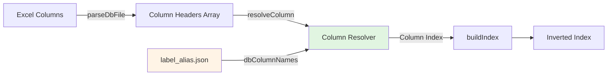

# Design Document

## Overview

This feature extends the existing `label_alias.json` configuration to support DB column name resolution in the index building phase. Currently, `label_alias` is only used for OCR text extraction (`extractor.ts`), while DB parsing (`builder.ts`) uses hardcoded column names (`field1Column: "s_field1"`, `field2Column: "s_field2"`). This design unifies field mapping across both OCR and DB processing.

**Key Insight**: We already have the alias infrastructure for OCR fields. This design mirrors that pattern for DB columns, maintaining consistency across the pipeline.

## Steering Document Alignment

### Technical Standards (tech.md)
No steering docs exist, but this design follows the project's established patterns:
- **Configuration Immutability**: New config schema extends existing `configs/vX.Y.Z/<sha>/` structure
- **Versioned Schemas**: Uses Zod validation like existing config files
- **Backward Compatibility**: Preserves existing function signatures

### Project Structure (structure.md)
Follows the monorepo architecture:
- Config schema extensions in `packages/ocr-match-core/src/config/schema.ts`
- Column resolution utilities in `packages/ocr-match-core/src/indexer/columnResolver.ts` (new)
- Integration in `packages/ocr-match-core/src/indexer/builder.ts`

## Code Reuse Analysis

### Existing Components to Leverage

- **`LabelAliasConfig` (schema.ts:22-28)**: Already defines `supplier`, `project`, `order` aliases for OCR extraction. We'll extend this with DB-specific metadata.
- **`parseDbFile()` (builder.ts:397-412)**: Current CSV/Excel parser. Will integrate with new column resolver.
- **`buildIndex()` (builder.ts:110-240)**: Main entry point. Will accept new config parameter while preserving backward compatibility.

### Integration Points

- **Config Loading (load.ts)**: Already loads `label_alias.json` into `FullConfig`. No changes needed—new schema is backward compatible.
- **OCR Extraction (extractor.ts)**: Uses `label_alias.supplier` and `label_alias.project` for text scanning. DB indexer will now use the same config for column matching.

## Architecture

### Design Pattern: "Alias Resolution Layer"



**Key Principle**: Separate column resolution from parsing logic. The resolver is a pure function:
```typescript
resolveColumn(
  headers: string[],
  aliases: string[],
  fieldName: string,
  required: boolean
) → columnIndex | null
```

### Modular Design Principles

- **Single File Responsibility**:
  - `columnResolver.ts`: Pure column matching logic (no file I/O)
  - `builder.ts`: Index construction orchestration (delegates to resolver)
  - `schema.ts`: Type definitions only

- **Component Isolation**:
  - Column resolver is stateless and testable in isolation
  - No direct file system access in resolver
  - Clear error messages generated at resolution time

- **Backward Compatibility Layer**:
  - `buildIndex()` accepts both old (`field1Column`) and new (`labelAliasConfig`) parameters
  - Priority: `labelAliasConfig` > `field1Column/field2Column` > defaults

## Components and Interfaces

### Component 1: FieldMappingConfig Schema Extension

**Purpose**: Extend `LabelAliasConfig` to include DB-specific metadata without breaking existing OCR usage.

**Interfaces**:
```typescript
// Schema extension (schema.ts)
export const LabelAliasConfigSchema = z.object({
  supplier: z.array(z.string()),
  project: z.array(z.string()),
  order: z.array(z.string()).optional(),

  // New: DB-specific metadata
  _dbColumnNames: z.object({
    supplier: z.array(z.string()).default(['供应单位名称']),
    project: z.array(z.string()).default(['单体工程名称']),
    order: z.array(z.string()).optional().default(['订单号', '订号']),
  }).optional(),
});

export type LabelAliasConfig = z.infer<typeof LabelAliasConfigSchema>;
```

**Dependencies**: None (pure schema definition)

**Reuses**: Existing `LabelAliasConfig` structure

**Design Rationale**:
- Use `_dbColumnNames` prefix to distinguish from OCR aliases
- Provide sensible defaults (current known column names)
- Optional field allows graceful degradation

### Component 2: Column Resolver Utility

**Purpose**: Pure function to resolve Excel column names to indices using aliases.

**Interfaces**:
```typescript
// packages/ocr-match-core/src/indexer/columnResolver.ts

export interface ColumnResolutionResult {
  index: number;
  matchedAlias: string;
}

/**
 * Resolve a column by searching for any of its aliases in headers
 * @param headers - Excel column headers
 * @param aliases - List of acceptable column names
 * @param fieldName - Logical field name (for error messages)
 * @param required - Whether this field must be found
 * @returns Column index and matched alias, or null if not found
 * @throws Error if required field is not found
 */
export function resolveColumn(
  headers: string[],
  aliases: string[],
  fieldName: string,
  required: boolean
): ColumnResolutionResult | null;

/**
 * Resolve all indexed fields (supplier + project)
 * @param headers - Excel column headers
 * @param dbColumnNames - DB column aliases from config
 * @returns Map of field names to column indices
 * @throws Error if any required field is missing
 */
export function resolveIndexedColumns(
  headers: string[],
  dbColumnNames: {
    supplier: string[];
    project: string[];
    order?: string[];
  }
): {
  supplierIdx: number;
  projectIdx: number;
  orderIdx: number | null;
};
```

**Dependencies**: None (pure logic)

**Reuses**: N/A (new utility)

**Error Handling**:
```typescript
// Example error message
throw new Error(
  `Required field "supplier" not found in Excel columns.\n` +
  `  Attempted aliases: ["供应单位名称"]\n` +
  `  Available columns: 订单号, 物料名称, 计划编号, ... (15 total)`
);
```

### Component 3: Enhanced buildIndex()

**Purpose**: Integrate column resolver while maintaining backward compatibility.

**Interfaces** (modified):
```typescript
export async function buildIndex(
  dbPathOrDir: string,
  normalizeConfig: NormalizeConfig,
  options: {
    ngramSize?: number;

    // LEGACY: Backward compatibility (deprecated but supported)
    field1Column?: string;  // fallback: 's_field1'
    field2Column?: string;  // fallback: 's_field2'

    // NEW: Preferred configuration
    labelAliasConfig?: LabelAliasConfig;
  } = {}
): Promise<InvertedIndex>;
```

**Dependencies**:
- `resolveIndexedColumns()` from `columnResolver.ts`
- Existing `parseDbFile()` logic

**Reuses**:
- `parseDbFile()` for CSV/Excel parsing
- `buildInvertedIndex()` for n-gram tokenization
- `computeDigest()` for file hashing

**Migration Path**:
```typescript
// Priority chain
const dbColumnNames = options.labelAliasConfig?._dbColumnNames ?? {
  supplier: [options.field1Column ?? 's_field1'],
  project: [options.field2Column ?? 's_field2'],
};
```

## Data Models

### Extended LabelAliasConfig

```json
{
  "supplier": [
    "供应商",
    "供应单位名称",
    "供应商联系人"
  ],
  "project": [
    "工程名称",
    "单体工程名称",
    "项目定义号"
  ],
  "order": [
    "订单号",
    "订号"
  ],
  "_dbColumnNames": {
    "supplier": ["供应单位名称"],
    "project": ["单体工程名称"],
    "order": ["订单号", "订号"]
  }
}
```

**Key Design Decision**: Separate OCR aliases from DB column names
- OCR aliases: Used in text extraction (may match partial strings like "供应商联系人")
- DB column names: Exact header matches in Excel files

### InvertedIndex (unchanged)

No changes to the inverted index structure:
```typescript
{
  version: '1.0',
  db_path: string,
  digest: string,
  total_rows: number,
  rows: DbRow[],  // Still uses f1/f2 internally
  inverted: Record<string, string[]>,
  meta: { unique_tokens, columns, ngram_size }
}
```

**Contract Preservation**: `DbRow.f1` and `DbRow.f2` remain unchanged (no breaking changes to downstream consumers).

## Error Handling

### Error Scenarios

1. **Scenario: Required column not found**
   - **Handling**: Throw descriptive error with attempted aliases and available columns
   - **User Impact**: Clear actionable message:
     ```
     Required field "supplier" not found in file "db1.xlsx"
       Attempted aliases: ["供应单位名称"]
       Available columns: 订单号, 物料名称, 计划编号, 供应商名称, ... (18 total)

     Hint: Update configs/vX.Y.Z/<sha>/label_alias.json with the correct column name.
     ```

2. **Scenario: Column mismatch between multi-file DB**
   - **Handling**: Existing logic in builder.ts:162-169 handles this (no changes needed)
   - **User Impact**: Error identifies which file has inconsistent columns

3. **Scenario: Optional field (order) not found**
   - **Handling**: Return `null` for `orderIdx`, log warning
   - **User Impact**: Processing continues, warning logged:
     ```
     [WARN] Optional field "order" not found in file "db1.xlsx"
       Attempted aliases: ["订单号", "订号"]
       Skipping order field extraction.
     ```

4. **Scenario: No configuration provided (backward compat)**
   - **Handling**: Fall back to `field1Column`/`field2Column` parameters, then to defaults
   - **User Impact**: Existing code continues working without modification

## Testing Strategy

### Unit Testing

**Test File**: `packages/ocr-match-core/src/indexer/columnResolver.test.ts`

Test cases:
1. ✅ `resolveColumn()` finds column by exact alias match
2. ✅ `resolveColumn()` returns first matching alias when multiple exist
3. ✅ `resolveColumn()` throws error for missing required field with clear message
4. ✅ `resolveColumn()` returns null for missing optional field
5. ✅ `resolveIndexedColumns()` resolves all required fields
6. ✅ `resolveIndexedColumns()` handles missing optional `order` field

### Integration Testing

**Test File**: `packages/ocr-match-core/src/indexer/builder.test.ts` (extend existing)

Test scenarios:
1. ✅ Build index with `labelAliasConfig._dbColumnNames` (new config)
2. ✅ Build index with legacy `field1Column`/`field2Column` (backward compat)
3. ✅ Build index with defaults when no config provided
4. ✅ Build multi-file DB directory with consistent columns
5. ✅ Error thrown when required column missing
6. ✅ Warning logged when optional column missing

### End-to-End Testing

**Test Flow**: Use real Excel file with varying column names

1. **Scenario**: Process DB with non-standard column names
   - Setup: Create `test-db.xlsx` with columns: `["订号", "供应单位名称", "单体工程名称", "物料名称"]`
   - Config: Use `label_alias.json` with `_dbColumnNames.order: ["订单号", "订号"]`
   - Expected: Index built successfully, `order` field resolved via "订号" alias

2. **Scenario**: Migration from hardcoded to config-based
   - Setup: Existing test using `field1Column: "s_field1"`
   - Action: Remove parameter, add `labelAliasConfig`
   - Expected: Same index produced, all tests pass

3. **Scenario**: Error message clarity
   - Setup: Excel file missing "供应单位名称" column
   - Expected: Error message lists attempted aliases and available columns

## Implementation Notes

### File Modification Summary

**New Files**:
- `packages/ocr-match-core/src/indexer/columnResolver.ts` (~80 lines)
- `packages/ocr-match-core/src/indexer/columnResolver.test.ts` (~150 lines)

**Modified Files**:
- `packages/ocr-match-core/src/config/schema.ts` (+8 lines: extend `LabelAliasConfigSchema`)
- `packages/ocr-match-core/src/indexer/builder.ts` (~50 lines changed: integrate resolver)
- `packages/ocr-match-core/src/indexer/builder.test.ts` (+100 lines: new test cases)

**Configuration Files** (user action required):
- `configs/vX.Y.Z/<sha>/label_alias.json` - Add `_dbColumnNames` section

### Migration Guide

**For existing projects**:

1. **Option A: Continue using legacy parameters** (no changes required)
   ```typescript
   buildIndex(dbPath, normalizeConfig, {
     field1Column: 's_field1',  // Still works
     field2Column: 's_field2',
   });
   ```

2. **Option B: Migrate to unified config** (recommended)
   ```typescript
   // 1. Update label_alias.json:
   {
     "supplier": ["供应商", "供应单位名称"],
     "project": ["工程名称", "单体工程名称"],
     "_dbColumnNames": {
       "supplier": ["供应单位名称"],
       "project": ["单体工程名称"]
     }
   }

   // 2. Update buildIndex call:
   buildIndex(dbPath, normalizeConfig, {
     labelAliasConfig: config.label_alias,
   });
   ```

### Performance Considerations

- Column resolution is O(n*m) where n = header count, m = alias count
- Typical Excel: ~20 headers, ~3 aliases → 60 comparisons (negligible)
- Resolution happens once per file during index build (not per row)

### Security Notes

- All column matching is case-sensitive (no fuzzy matching to prevent ambiguity)
- No regex or eval() in alias resolution
- Config validation via Zod schema prevents malformed input
