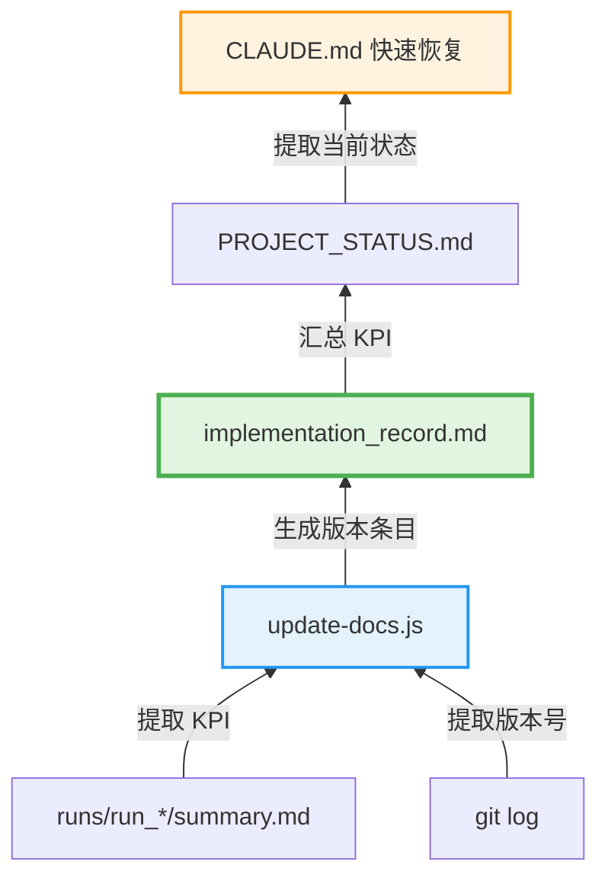

# Design Document

## Overview

本设计实现 DOCS_FLOW_REDESIGN 方案的 Phase 2（自动化脚本）和 Phase 3（文档重构），通过自动化消除手动文档更新的 30% 遗漏率，将 Context 消耗从 28k 降至 10k（-64%），文档更新时间从 40 分钟降至 15 分钟（-62%）。

**核心设计原则**（Linus 式好品味）：
1. **单一数据源真理** - implementation_record.md 是唯一手动维护的源
2. **信息金字塔** - 数据只向上流动（汇总），不向下传递
3. **消除特殊情况** - 用多重模式匹配替代脆弱的单一正则
4. **原子性操作** - 全部成功或全部失败，无半成品

## Steering Document Alignment

### Technical Standards (tech.md)

本设计符合项目技术标准：
- **Node.js ≥ 18** - 使用 ES Modules (`"type": "module"`)
- **零外部依赖** - 仅使用 Node.js 标准库（fs/promises, child_process）
- **严格模式** - 所有脚本顶部 `'use strict'`
- **错误处理** - 所有异步操作都有 try-catch，错误包含上下文

### Project Structure (structure.md)

遵循项目文件组织规范：
```
terminal-gd/
├── scripts/                    # 新增：自动化脚本
│   ├── update-docs.js         # 文档自动更新
│   ├── release.js             # 端到端发布流程
│   └── emergency-rollback.sh   # 已存在：紧急回滚
├── docs/                       # 重构：精简 + 自动生成标记
│   ├── implementation_record.md  # 单一数据源真理
│   ├── PROJECT_STATUS.md         # 当前状态仪表盘
│   └── ...
├── CLAUDE.md                   # 重构：快速恢复章节自动生成
└── package.json                # 更新：添加 npm scripts
```

## Code Reuse Analysis

### Existing Components to Leverage

- **scripts/emergency-rollback.sh** - 参考其严格模式和预检逻辑
  - `set -euo pipefail` 模式
  - `check_prerequisites()` 函数结构
  - 三阶段执行流程（check → execute → verify）
  - 彩色输出和进度提示风格

- **CLAUDE.md 版本发布工作流** - 参考文档更新流程
  - 5 阶段 checklist（规划 → 实施 → 测试 → 文档 → 提交）
  - Commit message 模板
  - 必须包含的文件列表

### Integration Points

- **package.json scripts** - 添加 `update-docs` 和 `release` 命令
- **runs/ 目录** - 读取最新运行包的 summary.md
- **docs/ 目录** - 更新 implementation_record.md 和 PROJECT_STATUS.md
- **CLAUDE.md** - 更新快速恢复章节
- **Git** - 提取版本号、创建 commits

## Architecture

### 整体架构：信息金字塔



**数据流向**：
1. **Source Layer**（源头）：runs/ + git log
2. **Truth Layer**（单一数据源）：implementation_record.md（手动补充技术洞察）
3. **Current Layer**（当前状态）：PROJECT_STATUS.md（自动汇总）
4. **Summary Layer**（快速恢复）：CLAUDE.md（自动生成）

### Modular Design Principles

1. **单一职责**：
   - `scripts/update-docs.js` - 负责数据提取和文档更新
   - `scripts/release.js` - 负责流程编排
   - 每个函数只做一件事（extractKPI/updateImplementationRecord/updateProjectStatus/updateClaudeMd）

2. **模块隔离**：
   - KPI 提取逻辑封装为独立函数，可单独测试
   - 原子更新封装为通用函数，可复用
   - 文档更新逻辑分离，易于维护

3. **服务层分离**：
   - Data Access：读取 runs/、git log、现有文档
   - Business Logic：KPI 提取、文本处理、模板生成
   - Presentation：Markdown 格式化、输出日志

## Components and Interfaces

### Component 1: update-docs.js（核心自动化脚本）

**Purpose**: 自动提取测试结果和 git 信息，更新所有相关文档

**Interfaces**:
```javascript
// 主函数
async function updateDocs(): Promise<void>

// KPI 提取（多重模式匹配）
function safeExtractKPI(content: string, metric: 'exact'|'review'|'fail'): KPIData

// 文档更新（原子性）
async function atomicUpdate(files: Map<string, string>): Promise<void>

// 版本条目生成
async function updateImplementationRecord(version, hash, date, kpi, runId): Promise<string>
async function updateProjectStatus(version, kpi): Promise<string>
async function updateClaudeMd(version, kpi, runId): Promise<string>
```

**Dependencies**:
- `fs/promises` - 文件读写
- `child_process.execSync` - 执行 git 命令

**Reuses**:
- emergency-rollback.sh 的严格错误处理模式
- CLAUDE.md 的文档更新 checklist

**Error Handling**:
- KPI 提取失败 → 抛出错误 + 展示原文前 200 字符
- 文件写入失败 → 原子回滚所有变更
- Git 命令失败 → 明确提示（如：无 git 仓库）

---

### Component 2: release.js（端到端发布流程）

**Purpose**: 引导用户完成测试 → 文档更新 → 手动补充 → Git commit 的完整流程

**Interfaces**:
```javascript
// 主函数
async function release(): Promise<void>

// 预检
async function checkTestRuns(): Promise<string>  // 返回最新运行包路径

// 交互式提示
async function promptUserInput(message: string): Promise<void>
```

**Dependencies**:
- `child_process.execSync` - 执行 npm run update-docs, git 命令
- `process.stdin` - 等待用户按 Enter

**Reuses**:
- update-docs.js 的完整逻辑
- CLAUDE.md 的 commit message 模板

**Error Handling**:
- 无测试运行包 → 抛出错误："Run tests first"
- Git 命令失败 → 明确提示（如：无暂存文件）

---

### Component 3: 文档重构（Markdown 结构调整）

**Purpose**: 精简文档，添加自动生成标记，建立清晰的信息层次

**Files to Modify**:
1. **CLAUDE.md**
   - 添加 `<!-- AUTO-GENERATED -->` 标记包围快速恢复章节
   - 精简为 ≤100 行（快速恢复部分）

2. **PROJECT_STATUS.md**
   - 删除重复内容（移至 implementation_record.md）
   - 精简为 ≤200 行（3 分钟读完）
   - 添加详细历史跳转链接

3. **implementation_record.md**
   - 添加顶部快速跳转（关键技术洞察的 anchor links）
   - 添加常见问题 FAQ（折叠式 `<details>`）
   - 标准化版本条目模板

**Interfaces** (模板字符串生成函数):
```javascript
function generateClaudeQuickRecovery(version, kpi, runId, date): string
function generateProjectStatusKPI(version, kpi): string
function generateImplementationRecordEntry(version, hash, date, kpi, runId): string
```

**Reuses**:
- 现有文档的内容和结构作为基础
- DOCS_FLOW_REDESIGN.md 的目标结构

## Data Models

### KPIData（KPI 数据模型）

```typescript
interface KPIData {
  exact: MetricData;
  review: MetricData;
  fail: MetricData;
}

interface MetricData {
  count: number;      // 案例数量（正整数）
  percent: number;    // 百分比（0-100 的浮点数）
}
```

**验证规则**:
- `count` 必须 > 0
- `percent` 必须在 [0, 100] 范围内
- `count` 和 `percent` 必须一致（基于总数 222）

**来源**: 从 runs/run_*/summary.md 提取

---

### VersionEntry（版本条目模型）

```typescript
interface VersionEntry {
  version: string;         // vX.Y.Z 格式
  title: string;           // 一句话描述（待手动补充）
  date: string;            // YYYY-MM-DD 格式
  gitHash: string;         // 短 commit hash（7 字符）
  runId: string;           // 运行包目录名
  kpi: KPIData;           // KPI 数据
  codeChanges: string[];  // 代码变更列表（待手动补充）
  insights: string[];     // 关键洞察（待手动补充）
}
```

**来源**:
- `version`, `gitHash`, `date` - 从 git log 提取
- `runId`, `kpi` - 从 runs/ 提取
- `title`, `codeChanges`, `insights` - 等待用户手动补充

---

### FileUpdate（文件更新模型）

```typescript
interface FileUpdate {
  path: string;           // 文件路径（相对于项目根目录）
  content: string;        // 新内容
  backup?: string;        // 备份内容（用于回滚）
}
```

**用途**: atomicUpdate 函数的输入

## Error Handling

### Error Scenarios

#### 1. KPI 提取失败（高风险）

**场景**: summary.md 格式变化导致所有正则模式都匹配失败

**Handling**:
```javascript
function safeExtractKPI(content, metric) {
  const patterns = {
    exact: [
      /Exact\s*[|:]\s*(\d+)\s*\/\s*\d+\s*\((\d+(?:\.\d+)?)%\)/,  // 主模式
      /Exact.*?(\d+).*?(\d+\.\d+)%/                               // 备份模式
    ],
    review: [/* 类似 */],
    fail: [/* 类似 */]
  };

  for (const pattern of patterns[metric]) {
    const match = content.match(pattern);
    if (match) {
      const kpi = { count: parseInt(match[1]), percent: parseFloat(match[2]) };
      // 验证合法性
      if (kpi.count > 0 && kpi.percent >= 0 && kpi.percent <= 100) {
        return kpi;
      }
    }
  }

  // 所有模式都失败
  throw new Error(
    `❌ Failed to extract ${metric} KPI. Summary format may have changed.\n` +
    `First 200 chars:\n${content.substring(0, 200)}`
  );
}
```

**User Impact**: 脚本立即失败，展示原文片段，用户可手动检查格式

---

#### 2. 原子更新失败（极高风险）

**场景**: 更新 3 个文档时，第 2 个文档写入失败（磁盘满/权限问题）

**Handling**:
```javascript
async function atomicUpdate(files) {
  const backups = new Map();

  try {
    // 阶段 1：创建所有文件的备份
    for (const [path, _] of files) {
      const content = await fs.readFile(path, 'utf-8');
      backups.set(path, content);
    }

    // 阶段 2：执行所有更新
    for (const [path, content] of files) {
      await fs.writeFile(path, content, 'utf-8');
    }

    console.log('✅ Atomic update succeeded');
  } catch (error) {
    // 阶段 3：失败时回滚所有变更
    console.error('❌ Update failed, rolling back...');
    for (const [path, content] of backups) {
      await fs.writeFile(path, content, 'utf-8');
    }
    throw new Error(`Atomic update failed: ${error.message}`);
  }
}
```

**User Impact**: 要么所有文档都更新成功，要么全部恢复原状，无半成品

---

#### 3. Git 信息提取失败（中风险）

**场景**: 不在 git 仓库中运行脚本，或最新 commit 没有版本号

**Handling**:
```javascript
function extractVersion() {
  try {
    const latestCommit = execSync('git log -1 --format="%h|%s|%ai"').toString();
    const [hash, subject, date] = latestCommit.split('|');
    const version = subject.match(/v\d+\.\d+\.\d+[a-z]?/)?.[0];

    if (!version) {
      throw new Error('No version found in latest commit subject');
    }

    return { version, hash: hash.trim(), date: date.split(' ')[0] };
  } catch (error) {
    throw new Error(
      `❌ Git command failed: ${error.message}\n` +
      `Ensure you are in a git repository and have committed code.`
    );
  }
}
```

**User Impact**: 明确提示用户检查 git 环境和 commit message 格式

---

#### 4. 运行包不存在（中风险）

**场景**: release.js 执行时 runs/ 目录为空

**Handling**:
```javascript
async function checkTestRuns() {
  const runsDir = await fs.readdir('runs');
  const runDirs = runsDir
    .filter(d => d.startsWith('run_'))
    .sort()
    .reverse();

  if (runDirs.length === 0) {
    throw new Error(
      '❌ No test runs found in runs/ directory.\n' +
      'Please run tests first:\n' +
      '  node packages/ocr-match-core/dist/cli/match-ocr.js ...'
    );
  }

  return runDirs[0];  // 返回最新运行包
}
```

**User Impact**: 明确提示用户先运行测试

## Testing Strategy

### Unit Testing

**关键组件测试**:

1. **safeExtractKPI** - KPI 提取函数
   - 测试所有正则模式（主模式 + 备份模式）
   - 测试边界情况（count=0, percent=100）
   - 测试非法输入（格式错误、缺失字段）

2. **atomicUpdate** - 原子更新函数
   - 测试成功场景（所有文件都写入成功）
   - 测试失败场景（模拟第 N 个文件写入失败）
   - 验证回滚机制（所有文件恢复原内容）

3. **版本条目生成函数**
   - 测试 Markdown 格式正确性
   - 测试占位符（"[等待补充]"）存在
   - 测试 KPI 表格格式

**测试工具**: Node.js 内置 `assert` 模块（无外部依赖）

**测试文件**: `scripts/__tests__/update-docs.test.mjs`

---

### Integration Testing

**关键流程测试**:

1. **完整文档更新流程**
   - 准备：创建临时 runs/ 目录 + 模拟 summary.md
   - 执行：运行 update-docs.js
   - 验证：检查 3 个文档都已更新且内容正确

2. **发布流程**
   - 准备：创建临时 git 仓库 + 提交代码
   - 执行：运行 release.js（自动化测试跳过交互式输入）
   - 验证：检查 git commit 已创建且 message 符合模板

**测试环境**: 临时目录（避免污染真实数据）

**测试文件**: `scripts/__tests__/integration.test.mjs`

---

### End-to-End Testing

**用户场景测试**:

1. **场景 1: 正常发布流程**
   - 用户完成代码开发 → 运行测试 → 运行 `npm run update-docs` → 手动补充技术洞察 → 运行 `npm run release`
   - 验证：所有文档正确更新，git commit 已创建

2. **场景 2: KPI 格式变化**
   - summary.md 使用新格式 → 运行 update-docs.js
   - 验证：脚本失败，展示清晰错误信息

3. **场景 3: 新 session 快速恢复**
   - 新 session 读取 CLAUDE.md 快速恢复章节
   - 验证：在 3 分钟内理解当前状态并开始工作

**执行方式**: 手动测试 + 脚本录屏（用于文档）

**验收标准**:
- Context 消耗 ≤ 10k tokens
- 文档更新时间 ≤ 15 分钟
- 错误率 = 0%（自动化保证）

## Implementation Plan

### Phase 2.1: 核心脚本实现（update-docs.js）

**优先级**: P0 - 核心功能

**任务列表**:
1. 实现 safeExtractKPI（多重模式匹配）
2. 实现 atomicUpdate（原子性更新）
3. 实现 updateImplementationRecord（顶部插入版本条目）
4. 实现 updateProjectStatus（更新 KPI 表格）
5. 实现 updateClaudeMd（更新快速恢复章节）
6. 集成主函数 updateDocs
7. 添加到 package.json scripts

**预期产出**:
- `scripts/update-docs.js`（~300 行）
- package.json 新增 `"update-docs": "node scripts/update-docs.js"`

---

### Phase 2.2: 发布流程脚本（release.js）

**优先级**: P1 - 提升体验

**任务列表**:
1. 实现 checkTestRuns（检查运行包）
2. 实现 promptUserInput（交互式提示）
3. 集成 update-docs.js 调用
4. 实现 git commit 创建
5. 添加到 package.json scripts

**预期产出**:
- `scripts/release.js`（~150 行）
- package.json 新增 `"release": "node scripts/release.js"`

---

### Phase 3.1: CLAUDE.md 重构

**优先级**: P0 - 核心文档

**任务列表**:
1. 添加 `<!-- AUTO-GENERATED -->` 标记
2. 精简快速恢复章节（删除手动维护部分）
3. 测试 update-docs.js 生成的内容

**预期产出**:
- 更新后的 CLAUDE.md（快速恢复章节 ≤100 行）

**Note**: 项目已设置 `"type": "module"`，脚本使用 `.js` 扩展名即可支持 ES Modules。

---

### Phase 3.2: PROJECT_STATUS.md 精简

**优先级**: P1 - 降低认知负担

**任务列表**:
1. 删除重复内容（版本历史移至 implementation_record.md）
2. 精简为 Top 3 计划 + Top 3 问题
3. 添加详细历史跳转链接

**预期产出**:
- 更新后的 PROJECT_STATUS.md（≤200 行）

---

### Phase 3.3: implementation_record.md 增强

**优先级**: P1 - 提升可发现性

**任务列表**:
1. 添加顶部快速跳转（关键技术洞察 anchor links）
2. 添加常见问题 FAQ（`<details>` 折叠）
3. 标准化版本条目模板

**预期产出**:
- 更新后的 implementation_record.md（增加导航和 FAQ）

## Performance Considerations

- **脚本执行时间**: ≤5 秒（提取 + 更新 3 个文档）
  - Git 命令执行：~100ms
  - 文件读取：~10ms × 6 个文件 = 60ms
  - 正则匹配：~1ms × 3 个指标 = 3ms
  - 文件写入：~20ms × 3 个文档 = 60ms
  - 总计：~300ms（远低于 5 秒目标）

- **内存占用**: ≤50MB
  - 读取所有文档内容：~500KB
  - 备份内容（原子更新）：~500KB
  - 运行时开销：~10MB
  - 总计：~11MB（远低于 50MB 目标）

- **并发安全**: 单线程执行，无并发问题

## Security Considerations

- **路径验证**: 所有文件操作都在项目根目录下，拒绝 `..` 路径
- **命令注入防护**: execSync 参数固定，不包含用户输入
- **文件权限**: 生成的文档权限与原文件一致（`fs.copyFile` 保留权限）

## Rollback Strategy

如果自动化脚本导致问题：

1. **手动回滚文档**:
   ```bash
   git restore docs/ CLAUDE.md
   ```

2. **禁用脚本**:
   ```bash
   # 临时注释 package.json 的 update-docs 脚本
   # 恢复手动更新流程
   ```

3. **修复脚本**:
   - 分析错误日志
   - 修复 KPI 提取正则
   - 测试后重新部署

## Dependencies

**Runtime**:
- Node.js ≥ 18（项目已设置 `"type": "module"`）

**Standard Library**:
- `fs/promises` - 异步文件操作
- `child_process` - 执行 git 命令

**Development** (可选):
- `assert` - 单元测试（Node.js 内置）

**Zero External Dependencies** - 符合 Linus 简洁性原则

## Success Metrics

| 指标 | 目标值 | 验证方式 |
|------|--------|----------|
| Context 消耗 | ≤10k tokens | 新 session 读取 CLAUDE.md 快速恢复即可开始工作 |
| 文档更新时间 | ≤15min | `npm run update-docs` + 手动补充 ≤15min |
| 文档遗漏率 | 0% | 自动化脚本保证 7 处同步更新 |
| 脚本执行时间 | ≤5s | 实测 update-docs.js 执行时间 |
| 新 session 理解时间 | ≤3min | 用户反馈调查 |

## References

- **DOCS_FLOW_REDESIGN.md** - 原始方案
- **DOCS_FLOW_REDESIGN-refine.md** - Linus 式深度分析
- **scripts/emergency-rollback.sh** - 回滚脚本参考
- **CLAUDE.md 版本发布工作流** - 文档更新流程参考
