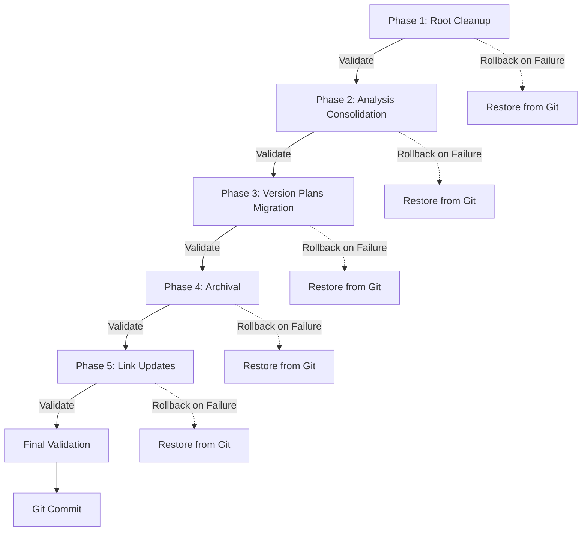

# Design Document

## Overview

This design implements a systematic documentation reorganization following Linus Torvalds' "Good Taste" principles. The solution uses atomic file operations, automated link updates, and comprehensive validation to eliminate documentation sprawl while maintaining 100% link integrity.

**Core Philosophy**: "Good taste means eliminating special cases" - no `current/` directory, no root-level temporary docs, no redundant analysis files.

## Steering Document Alignment

### Technical Standards (CLAUDE.md)

The design follows **Rule 1: Single Change Principle** by breaking the reorganization into atomic phases:
- Phase 1: Root directory cleanup (1-2 files)
- Phase 2: Analysis consolidation (docs-flow-automation)
- Phase 3: Version plan migration (current/ → version dirs)
- Phase 4: Archival of completed work
- Phase 5: Link integrity validation

Each phase can be validated and rolled back independently.

### Project Structure (docs/PROJECT_STATUS.md)

Maintains the established documentation hierarchy:
```
docs/           - Current status (auto-generated by update-docs.js)
analysis/       - Deep analysis organized by version/topic
  v0.1.X/       - Version-specific analysis
  archived/     - Completed work (>7 days old)
  [topic]/      - Topic-specific analysis (e.g., docs-flow-automation)
.spec-workflow/ - Specification-driven development
```

## Code Reuse Analysis

### Existing Components to Leverage

- **Git Operations**: Use existing git commands (mv) to preserve file history
- **Bash Scripts**: Leverage scripts/update-docs.js pattern for automation
- **Grep/Ripgrep**: Utilize for finding and replacing markdown links
- **Node.js fs module**: Reuse for file operations (already in scripts/update-docs.js)

### Integration Points

- **docs/PROJECT_STATUS.md**: Update version history links after reorganization
- **docs/implementation_record.md**: Update FAQ and navigation links
- **CLAUDE.md**: Update "关键文档导航" section with new paths
- **.gitignore**: Ensure moved files remain tracked (no new exclusions needed)

## Architecture

The design uses a **staged pipeline architecture** with validation checkpoints between each stage:



### Modular Design Principles

- **Single File Responsibility**: Each markdown file addresses one topic/version
- **Component Isolation**: Phases are independent; failure in Phase 3 doesn't affect Phase 1-2
- **Service Layer Separation**: File operations, link updates, and validation are separate concerns
- **Utility Modularity**: Link finder, link updater, and link validator are separate functions

## Components and Interfaces

### Component 1: Root Directory Cleaner

- **Purpose:** Move temporary design documents from root to analysis/archived/
- **Interfaces:**
  ```bash
  moveToArchived(sourceFile: string, reason: string): Promise<void>
  validateRootPurity(): boolean  # Returns true if only README.md + CLAUDE.md remain
  ```
- **Dependencies:** Git (for preserving history with `git mv`)
- **Reuses:** Standard bash file operations

**Operation:**
```bash
# DOCS_FLOW_REDESIGN.md → analysis/archived/
git mv DOCS_FLOW_REDESIGN.md analysis/archived/
```

### Component 2: Analysis Document Consolidator

- **Purpose:** Merge 3 gitignore analysis documents into one authoritative guide
- **Interfaces:**
  ```bash
  mergeDocuments(files: string[], outputFile: string, strategy: 'merge' | 'select-best'): Promise<void>
  archiveOriginals(files: string[], archiveDir: string): Promise<void>
  ```
- **Dependencies:** File I/O (fs module)
- **Reuses:** Markdown parsing/generation patterns

**Merge Strategy:**
1. **Read all 3 files**: GITIGNORE_STRATEGY.md, COMPLETE_GITIGNORE_GUIDE.md, GIT_STRATEGY_ANALYSIS.md
2. **Extract unique sections**:
   - Problem statement (common across all)
   - Solutions (merge best practices from all 3)
   - Implementation (take most recent/complete)
   - Examples (combine all unique examples)
3. **Generate GIT_INTEGRATION_GUIDE.md** with consolidated content
4. **Move originals** to archived/

**Output Structure:**
```markdown
# Git Integration Guide

## Problem
[Consolidated problem statement]

## Solution
[Merged best practices from all 3 docs]

## Implementation
[Most complete implementation guide]

## Examples
[All unique examples]

## History
[Links to original 3 docs in archived/]
```

### Component 3: Version Plan Migrator

- **Purpose:** Move historical version plans from current/ to version directories
- **Interfaces:**
  ```bash
  migrateVersionPlan(planFile: string, targetVersion: string): Promise<void>
  deleteEmptyDirectory(dirPath: string): Promise<void>
  ```
- **Dependencies:** Git (git mv), path resolution
- **Reuses:** Existing version directory structure (analysis/v0.1.X/)

**Operations:**
```bash
git mv analysis/current/v0.1.5_plan.md analysis/v0.1.5/plan.md
git mv analysis/current/v0.1.6_plan.md analysis/v0.1.6/plan.md
git mv analysis/current/v0.1.7_extraction_fix_plan.md analysis/v0.1.7/plan.md
git mv analysis/current/提取逻辑根本缺陷诊断报告.md analysis/v0.1.6/extraction_issues.md
rmdir analysis/current/  # Only if empty
```

### Component 4: Archival Manager

- **Purpose:** Move completed analysis documents to archived/
- **Interfaces:**
  ```bash
  isArchivable(file: string): boolean  # Check age and completion status
  archiveCompletedWork(file: string): Promise<void>
  createArchivedReadme(): Promise<void>
  ```
- **Dependencies:** File metadata (mtime), git log
- **Reuses:** archived/ directory structure

**Archival Criteria:**
- File older than 7 days
- Describes completed work (no pending tasks)
- Not referenced in active documents (PROJECT_STATUS.md "进行中" sections)

**Files to Archive:**
- `analysis/P0_optimization_report_20251113.md` (P0 work completed on 2025-11-13)
- `analysis/docs-flow-automation/ARCHITECTURE_REVIEW.md` (implementation complete)
- `analysis/docs-flow-automation/ULTRATHINK_ANALYSIS.md` (implementation complete)

### Component 5: Link Integrity Manager

- **Purpose:** Find and update all markdown links after file reorganization
- **Interfaces:**
  ```bash
  findAllLinks(rootDir: string): Array<{file: string, links: string[]}>
  updateLink(file: string, oldPath: string, newPath: string): Promise<void>
  validateLinks(rootDir: string): Promise<{valid: number, broken: number, brokenLinks: Array}>
  ```
- **Dependencies:** Ripgrep (for fast link search), markdown link parser
- **Reuses:** Grep patterns from existing codebase search

**Link Update Strategy:**

1. **Find all markdown links**:
   ```bash
   rg '\[.*\]\(\.\.?/.*\.md\)' -t md --json  # Find all relative markdown links
   ```

2. **Build path mapping table**:
   ```
   Old Path → New Path
   ────────────────────────────────────────────────────────────
   DOCS_FLOW_REDESIGN.md → analysis/archived/DOCS_FLOW_REDESIGN.md
   analysis/current/v0.1.5_plan.md → analysis/v0.1.5/plan.md
   [etc...]
   ```

3. **Update links in affected files**:
   - docs/PROJECT_STATUS.md
   - docs/implementation_record.md
   - CLAUDE.md
   - All version directories

4. **Validate all links**:
   ```bash
   # For each link [text](path):
   #   1. Resolve relative path from source file
   #   2. Check if target file exists
   #   3. Report any broken links
   ```

## Data Models

### FileMove Record
```typescript
interface FileMove {
  source: string;           // Original path
  destination: string;      // New path
  reason: string;          // Why moved (e.g., "Root directory cleanup")
  movedAt: Date;           // Timestamp
  gitPreserved: boolean;   // Whether git history preserved (git mv vs mv)
}
```

### LinkUpdate Record
```typescript
interface LinkUpdate {
  file: string;            // File containing the link
  oldLink: string;         // Original link path
  newLink: string;         // Updated link path
  lineNumber: number;      // Line number in file
  verified: boolean;       // Whether new link resolves correctly
}
```

### ValidationReport
```typescript
interface ValidationReport {
  phase: string;                    // Which phase validated
  filesAffected: number;            // Number of files modified
  linksUpdated: number;             // Number of links changed
  brokenLinks: Array<{              // Any broken links found
    file: string;
    link: string;
    lineNumber: number;
  }>;
  passedChecks: string[];           // List of passed validations
  failedChecks: string[];           // List of failed validations
  canProceed: boolean;              // Whether safe to continue
}
```

## Error Handling

### Error Scenarios

1. **Scenario 1: File Move Fails (Permission/Lock)**
   - **Handling:** Catch error, log which file failed, rollback previous moves in phase
   - **User Impact:** Phase fails gracefully, previous phases remain intact
   - **Rollback:** `git restore <moved-files>`

2. **Scenario 2: Document Merge Creates >20KB File**
   - **Handling:** Warn user, ask if should proceed or use select-best strategy instead
   - **User Impact:** Prompted to choose merge strategy
   - **Fallback:** Select best document instead of merging all

3. **Scenario 3: Link Update Breaks Existing Links**
   - **Handling:** Validate links before committing; if validation fails, restore original files
   - **User Impact:** See validation report with all broken links listed
   - **Rollback:** `git restore <files-with-updated-links>`

4. **Scenario 4: current/ Directory Not Empty After Migration**
   - **Handling:** List remaining files, ask user if they should be archived or moved elsewhere
   - **User Impact:** Manual decision required for unknown files
   - **Safety:** Do not auto-delete; require explicit user confirmation

5. **Scenario 5: Git History Lost (Used mv Instead of git mv)**
   - **Handling:** Detect if git mv available; fallback to mv only if git not available
   - **User Impact:** Warning shown if history will be lost
   - **Mitigation:** Always prefer `git mv` to preserve file history

## Testing Strategy

### Unit Testing

- **Link Finder**: Test with various markdown link formats
  - `[text](relative/path.md)`
  - `[text](../parent/path.md)`
  - `[text](/absolute/path.md)`
  - Edge case: `[text](path with spaces.md)`

- **Path Resolver**: Test relative path resolution
  - Input: `file: docs/PROJECT_STATUS.md, link: ../analysis/v0.1.6/plan.md`
  - Expected: `analysis/v0.1.6/plan.md`

- **Link Validator**: Test existence checking
  - Valid link: returns `{valid: true, resolved: "analysis/v0.1.6/plan.md"}`
  - Broken link: returns `{valid: false, error: "File not found"}`

### Integration Testing

- **Phase 1-5 Pipeline**: Run full reorganization on test copy of repo
  1. Clone repo to temp directory
  2. Run all phases
  3. Verify final state matches expected structure
  4. Validate all links resolve
  5. Check git history preserved (git log --follow)

- **Rollback Mechanism**: Test failure scenarios
  1. Inject failure in Phase 3
  2. Verify Phases 1-2 remain intact
  3. Verify Phase 3 rolls back completely
  4. Verify can re-run from Phase 3

### End-to-End Testing

- **User Scenario 1: Developer searches for gitignore guide**
  - Before: Finds 3 documents, unsure which to read
  - After: Finds 1 `GIT_INTEGRATION_GUIDE.md`, reads it in 5 minutes

- **User Scenario 2: Developer looks for v0.1.5 plan**
  - Before: Checks current/ directory (confusing - v0.1.5 is historical)
  - After: Goes to `analysis/v0.1.5/plan.md` (intuitive location)

- **User Scenario 3: New contributor opens project**
  - Before: Sees `DOCS_FLOW_REDESIGN.md` in root, confused what it is
  - After: Sees only `README.md` + `CLAUDE.md`, immediately understands structure

## Implementation Sequence

### Phase Order (with dependencies)

1. **Phase 1**: Root cleanup (no dependencies)
2. **Phase 2**: docs-flow-automation consolidation (no dependencies)
3. **Phase 3**: Version plan migration (no dependencies)
4. **Phase 4**: Archival (depends on Phase 1-3 completing, to avoid moving files twice)
5. **Phase 5**: Link updates (depends on all previous phases, knows final file locations)

### Validation Checkpoints

After each phase:
- Run `git status` - verify expected files moved
- Run `ls -la` on affected directories - verify structure correct
- Run link validator - verify no broken links introduced
- If any check fails: STOP, rollback phase, investigate

### Atomic Commit Strategy

- **Option A: Single Commit** (Recommended)
  - All 5 phases in one commit
  - Easier to rollback if problems discovered later
  - Commit message: `docs: reorganize documentation structure (eliminate special cases)`

- **Option B: Phased Commits**
  - One commit per phase
  - Easier to bisect if specific phase causes issues
  - Risk: Intermediate states may have broken links

**Recommendation**: Use Option A (single commit) because link updates in Phase 5 make intermediate states inconsistent.

## Success Criteria

### Quantitative Metrics

- Root directory .md files: 3 → 2 (-33%)
- docs-flow-automation files: 5 → 2 (-60%, 1 active + 1 archived dir)
- analysis/current/ files: 4 → 0 (-100%, directory deleted)
- Broken links: 0 (100% link integrity maintained)
- Documentation redundancy: 68KB → 15KB (-78% in docs-flow-automation)

### Qualitative Metrics

- ✅ Root directory only contains entry documents (README, CLAUDE)
- ✅ Every version directory contains its own plan.md
- ✅ No "special case" directories (current/, temp/, etc.)
- ✅ All internal markdown links resolve correctly
- ✅ Git history preserved for all moved files (git log --follow works)
- ✅ archived/ README.md explains archival criteria clearly

### Linus Approval Test

**Question**: "Does this structure eliminate special cases?"

**Answer**:
- ✅ No root-level temporary docs (DOCS_FLOW_REDESIGN moved)
- ✅ No `current/` directory (historical plans in version dirs)
- ✅ No redundant analysis (3 gitignore docs → 1)
- ✅ Consistent structure (every version dir has plan.md + reports)

**Linus would say**: "Good. Now it has good taste."
