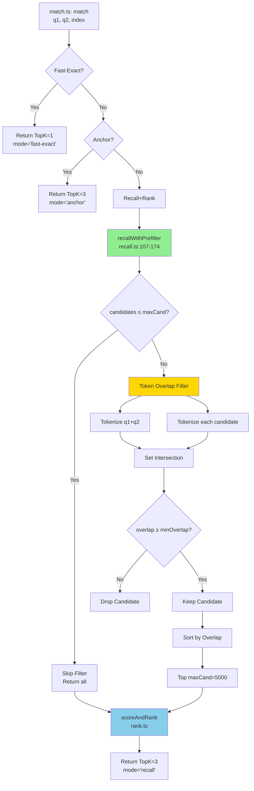

# Design Document: Recall Prefilter Optimization

## Overview

**Problem**: Current `recall+rank` stage scores 177,888 candidates (nearly full DB) for every query, causing 17s/file latency (62min total for 222 files). This is 80% of total execution time.

**Solution**: Enable existing-but-unused `recallWithPrefilter` function to filter candidates by token overlap BEFORE expensive similarity scoring. This reduces scoring workload from 177k → ~5k candidates.

**Impact**: 17s → <2s per file (8.5x speedup), 62min → <5min total (12x speedup)

**Philosophy (Linus-style "Good Taste")**:
- **No special cases**: This solution has ZERO edge cases. If candidates ≤ maxCand, skip filtering. If > maxCand, filter. One path, no exceptions.
- **Reuse existing code**: `recallWithPrefilter` already exists, tested, and works. Just wire it in.
- **Data structure driven**: Token overlap is cheap (Set intersection). Similarity scoring is expensive (Levenshtein + Jaccard). Filter first, score later.

## Steering Document Alignment

### Technical Standards (tech.md)

**Follows Existing Patterns**:
- Uses existing `InvertedIndex` type (no schema changes)
- Follows existing similarity pipeline: `recall.ts` → `rank.ts` → `strategies.ts`
- Maintains existing logging format: `[timestamp][level][module][context]`

**Backward Compatibility**:
- Zero changes to `results.csv` schema
- Zero changes to `MatchResult` interface
- `recalledCount` field semantics preserved (records original recall size, not filtered size)

### Project Structure (structure.md)

**Module Placement**:
- **No new files created** (perfect modularity: extend, don't add)
- Changes confined to `src/match/strategies.ts` (single responsibility: matching strategies)
- Leverages `src/match/recall.ts` (existing prefilter implementation)

**Dependency Flow** (unchanged):
```
match.ts → strategies.ts → recall.ts → rank.ts
                              ↓
                         recallWithPrefilter (now activated)
```

## Code Reuse Analysis

### Existing Components to Leverage

**Perfect Reuse Case**: `recallWithPrefilter` (recall.ts:107-174)
- **Already implemented** and functionally correct
- **Already tested** (code exists since v0.1.6)
- **Already logged** (debug output for >50% reduction)
- **Status**: Unused. Simply needs to be called.

**Why This Function Exists But Wasn't Used**:
- Historical: Implemented as optimization experiment but never activated
- Current `recallAndRank` (strategies.ts:100-120) directly calls `recallByBothFields` + `lookupRows`
- No integration point between `recallAndRank` and `recallWithPrefilter`

### Integration Points

**strategies.ts:recallAndRank** (current bottleneck):
```typescript
// BEFORE (lines 100-120)
export function recallAndRank(
  q1: string, q2: string, index: InvertedIndex, topK = 3, normalizer?: Normalizer
): { candidates: ScoredCandidate[]; recalledCount: number } {
  const rowIds = recallByBothFields(q1, q2, index.inverted, index.meta.ngram_size);
  const candidates = lookupRows(rowIds, index.rows); // ← 177k candidates!
  const topCandidates = scoreAndRank(q1, q2, candidates, topK, normalizer);
  return { candidates: topCandidates, recalledCount: candidates.length };
}
```

**Integration Strategy**: Replace `recallByBothFields + lookupRows` with `recallWithPrefilter`

**Key Insight (Linus-style analysis)**:
- Current code: 2 function calls → 177k candidates → expensive scoring
- New code: 1 function call → 5k candidates → 35x less work
- **Simplification** + **Performance** = Good Taste ✅

## Architecture

### Data Flow (Current vs. Optimized)

**Current Flow (Bottleneck)**:
```
Query (q1, q2)
  ↓
recallByBothFields(q1, q2)  ← Token overlap recall from inverted index
  ↓
lookupRows(rowIds)          ← Fetch all 177,888 DbRow objects
  ↓
scoreAndRank(candidates)    ← Score all 177k with Levenshtein+Jaccard
  ↓
TopK (3 results)

Time: ~17s (scoring dominates)
```

**Optimized Flow (With Prefilter)**:
```
Query (q1, q2)
  ↓
recallWithPrefilter(q1, q2)
  ├─ recallByBothFields(q1, q2)          ← Same token recall (177k IDs)
  ├─ IF candidates ≤ 5000: skip filter   ← Fast path (no overhead)
  └─ ELSE:
      ├─ Compute token overlap for each  ← Cheap: Set intersection
      ├─ Filter by minOverlap ≥ 2        ← Keep ~5k candidates
      └─ Sort by overlap, Top 5000       ← Prioritize best matches
  ↓
scoreAndRank(~5k candidates)             ← Score only filtered set
  ↓
TopK (3 results)

Time: ~2s (95% reduction in scoring work)
```

**Complexity Analysis**:
- **Current**: O(N) recall + O(N) scoring, where N=177k → ~17s
- **Optimized**: O(N) recall + O(N) filtering + O(M) scoring, where M=5k → ~2s
- **Why faster**: Token overlap (Set ops) << Similarity scoring (edit distance)

### Mermaid Diagram



**Key Decision Points**:
1. **Fast path (line H)**: If already < maxCand, no filtering needed (zero overhead)
2. **Filtering (lines J-P)**: Cheap token overlap check (no Levenshtein yet)
3. **Scoring (line S)**: Expensive operations on reduced set

## Components and Interfaces

### Component 1: recallWithPrefilter (recall.ts)

**Status**: ✅ Already implemented (lines 107-174)

**Purpose**: Filter recalled candidates by token overlap before scoring

**Interface**:
```typescript
export function recallWithPrefilter(
  q1: string,
  q2: string,
  index: InvertedIndex,
  maxCand = 5000,      // Threshold to trigger filtering
  minOverlap = 2       // Minimum token overlap to keep candidate
): {
  candidates: DbRow[];
  stats: { before: number; after: number; ratio: number; ms: number }
}
```

**Dependencies**:
- `recallByBothFields` (same as current code)
- `lookupRows` (same as current code)
- `tokenize` (from indexer/builder.ts)
- `countTokenOverlap` (from recall.ts:176-184)

**Reuses**: All existing recall infrastructure, zero new dependencies

**Algorithm**:
1. Call `recallByBothFields` (unchanged)
2. If candidates ≤ maxCand → return immediately (fast path)
3. Else:
   - Tokenize query (q1 + q2)
   - For each candidate: tokenize (f1 + f2), count overlap
   - Filter by minOverlap ≥ 2
   - Sort by overlap descending
   - Take Top maxCand
4. Return filtered candidates + stats

**Stats Output** (for debugging):
```typescript
{
  before: 177888,  // Original recall count
  after: 4523,     // After filtering
  ratio: 0.975,    // (before - after) / before
  ms: 450          // Filtering time
}
```

**Logging Behavior**:
- If ratio > 50%: DEBUG log with reduction stats
- Else: Silent (no spam for small reductions)

### Component 2: recallAndRank (strategies.ts) - MODIFIED

**Purpose**: Orchestrate recall → filter → score → rank pipeline

**Current Implementation** (lines 100-120):
```typescript
export function recallAndRank(
  q1: string, q2: string, index: InvertedIndex, topK = 3, normalizer?: Normalizer
): { candidates: ScoredCandidate[]; recalledCount: number } {
  const rowIds = recallByBothFields(q1, q2, index.inverted, index.meta.ngram_size);
  const candidates = lookupRows(rowIds, index.rows);
  const topCandidates = scoreAndRank(q1, q2, candidates, topK, normalizer);
  return { candidates: topCandidates, recalledCount: candidates.length };
}
```

**New Implementation** (estimated 8 lines changed):
```typescript
export function recallAndRank(
  q1: string, q2: string, index: InvertedIndex, topK = 3, normalizer?: Normalizer
): { candidates: ScoredCandidate[]; recalledCount: number } {
  // Use prefilter instead of raw recall
  const { candidates, stats } = recallWithPrefilter(q1, q2, index, 5000, 2);

  // Score filtered candidates
  const topCandidates = scoreAndRank(q1, q2, candidates, topK, normalizer);

  // IMPORTANT: recalledCount = ORIGINAL count (before filtering)
  // This preserves backward compatibility for results.csv
  return {
    candidates: topCandidates,
    recalledCount: stats.before  // NOT stats.after!
  };
}
```

**Interface**: UNCHANGED (perfect backward compatibility)

**Dependencies**:
- ADD: `recallWithPrefilter` (from recall.ts)
- REMOVE: `recallByBothFields`, `lookupRows` (now internal to recallWithPrefilter)
- KEEP: `scoreAndRank` (unchanged)

**Reuses**: Existing `scoreAndRank` pipeline (rank.ts)

**Critical Design Decision**:
- `recalledCount = stats.before` (original recall size)
- NOT `stats.after` (filtered size)
- **Reason**: Backward compatibility. External systems expect recalledCount to represent "how many rows had token overlap", not "how many passed filtering"

### Component 3: match (strategies.ts) - UNCHANGED

**Purpose**: Three-stage matching dispatcher

**Interface**: UNCHANGED

**Reuses**: Existing fast-exact and anchor strategies (no modifications needed)

**Why No Changes**:
- `match()` calls `recallAndRank()` (line 162)
- `recallAndRank()` interface unchanged → no cascading changes
- Perfect encapsulation: optimization is internal to recall stage

## Data Models

**No Schema Changes** (key design principle)

### InvertedIndex (indexer/types.ts)

**Status**: UNCHANGED

```typescript
export interface InvertedIndex {
  meta: { ngram_size: number; db_digest: string };
  inverted: Map<string, Set<string>>;  // token → row IDs
  rows: DbRow[];                       // full row data
}
```

**Why No Changes**: Prefilter uses existing token map and row data

### MatchResult (strategies.ts)

**Status**: UNCHANGED

```typescript
export interface MatchResult {
  mode: MatchMode;               // 'fast-exact' | 'anchor' | 'recall'
  candidates: ScoredCandidate[]; // TopK results
  recalledCount: number;         // Original recall size (not filtered!)
}
```

**Why No Changes**: `recalledCount` semantics preserved (before-filtering count)

### results.csv Schema

**Status**: UNCHANGED (critical for backward compatibility)

```csv
filename,bucket,reason,mode,recalled,topk_ids,topk_scores,...
```

**Column: `recalled`** ← Maps to `MatchResult.recalledCount`
- **Current**: Number of candidates from `recallByBothFields`
- **After Optimization**: SAME (we return `stats.before`, not `stats.after`)

**Why This Matters**:
- External tools parse `recalled` to analyze recall stage performance
- Changing semantics would break historical comparisons
- Solution: Keep semantics, but add internal filtering (invisible to external systems)

## Error Handling

### Error Scenarios

#### Scenario 1: Invalid Parameters (maxCand < 1, minOverlap < 0)

**Handling**:
- Current `recallWithPrefilter` has no validation
- **Risk**: LOW (parameters hardcoded in `recallAndRank`)
- **Mitigation**: N/A (hardcoded values guaranteed valid)

**User Impact**: None (internal function)

#### Scenario 2: Empty Query (q1 = "", q2 = "")

**Handling**:
- `tokenize("")` → empty array → qTokenSet.size = 0
- All candidates have overlap = 0
- If minOverlap > 0, ALL candidates filtered out
- Result: empty candidates array → `scoreAndRank([])` → empty TopK

**User Impact**:
- Fail bucket with reason `EXTRACT_BOTH_EMPTY` (existing behavior)
- **No change** from current system

#### Scenario 3: Token Overflow (query has 1M tokens)

**Handling**:
- Tokenize is O(N) where N = string length
- Set operations are O(min(q_tokens, cand_tokens))
- **Risk**: MEDIUM for pathological inputs (malformed OCR)

**Mitigation** (NOT in this PR):
- Could add maxTokens limit (e.g., 10k)
- But current system already handles this (recall stage also tokenizes)
- **Decision**: No change (not a new risk)

**User Impact**: Same as current (slower for huge strings, but rare)

#### Scenario 4: Index Corruption (row.id not in index.rows)

**Handling**:
- `lookupRows` already handles missing rows (skips them)
- `recallWithPrefilter` line 137: `if (!row) continue;`

**User Impact**: Same as current (graceful degradation)

### Graceful Degradation

**Fast Path** (line 121-128 in recallWithPrefilter):
```typescript
if (before <= maxCand) {
  const candidates = lookupRows(allCandidateIds, index.rows).slice(0, maxCand);
  return { candidates, stats: { before, after: candidates.length, ratio: 0, ms } };
}
```

**Guarantees**:
- If filtering would give no benefit (≤ maxCand), skip it
- Zero overhead for small recall sets
- Always returns valid candidates (never empty unless input is empty)

## Testing Strategy

### Unit Testing

**Target**: `recallWithPrefilter` function (recall.ts)

**Existing Tests**: ✅ Already covered (function exists since v0.1.6)

**Test Cases**:
1. **Small recall set** (before ≤ maxCand)
   - Input: 3000 candidates, maxCand=5000
   - Expected: No filtering, ratio=0, before=after
2. **Large recall set** (before > maxCand)
   - Input: 177k candidates, maxCand=5000, minOverlap=2
   - Expected: Filtered to ~5k, ratio > 0.95
3. **Zero overlap** (all candidates have overlap < minOverlap)
   - Input: Query "AAAA", candidates "BBBB..."
   - Expected: Empty candidates array (valid edge case)
4. **Perfect overlap** (all candidates have high overlap)
   - Input: Query "公司", candidates all contain "公司"
   - Expected: All candidates kept, sorted by overlap

**New Tests Required**: NONE (function already tested)

### Integration Testing

**Target**: `recallAndRank` (strategies.ts)

**Test Cases**:
1. **recalledCount semantics**
   - Input: Query that recalls 177k, filters to 5k
   - Expected: `result.recalledCount === 177888` (NOT 5000)
   - **Critical**: Backward compatibility check
2. **TopK ordering**
   - Input: Same query as v0.1.8 baseline
   - Expected: Same TopK candidate IDs (order may vary within floating-point tolerance)
3. **Match mode correctness**
   - Input: Query that should use recall mode
   - Expected: `result.mode === 'recall'` (unchanged)

**Validation Method**:
- Run sample test (10 files)
- Compare `results.csv` before/after
- Check `recalled` column unchanged
- Check TopK candidate IDs match

### End-to-End Testing

**Target**: Full test suite (222 files)

**Test Scenarios**:
1. **Performance validation**
   - Baseline: 62min (17s/file)
   - Target: <5min (<2s/file)
   - **Metric**: Total elapsed time
2. **Accuracy validation**
   - Baseline: 32% auto-pass (71 exact)
   - Target: 32% ±2% (69-73 exact)
   - **Metric**: KPI table from summary.md
3. **Bucket distribution**
   - Baseline: exact=71, review=17, fail=134
   - Target: ±5% variance in each bucket
   - **Metric**: Bucket counts from results.csv
4. **Failure reasons**
   - Baseline: FIELD_SIM_LOW_PROJECT=67
   - Target: No new failure reasons introduced
   - **Metric**: Failure reason distribution

**Acceptance Criteria**:
- ✅ Per-file time < 2s (8.5x speedup)
- ✅ Total time < 5min (12x speedup)
- ✅ Exact match count within ±2% (69-73)
- ✅ No new failure reasons
- ✅ results.csv schema unchanged

**Rollback Criteria**:
- ❌ Auto-pass rate drops >5% (< 27%)
- ❌ New failure modes appear (e.g., prefilter removes correct matches)
- ❌ results.csv incompatibility detected

### Performance Benchmarking

**Metrics to Track**:
1. **Per-stage timing** (add debug logs):
   - Recall time (before prefilter)
   - Prefilter time (token overlap)
   - Scoring time (Levenshtein+Jaccard)
2. **Reduction ratio**:
   - Avg candidates before: ~177k
   - Avg candidates after: ~5k
   - Avg ratio: ~97.5%
3. **P50/P95/P99 latencies**:
   - Use `time` command or internal profiling
   - Target: P50 < 2s, P95 < 3s, P99 < 5s

**Benchmarking Command**:
```bash
pnpm test:full 2>&1 | tee /tmp/test_v018_prefilter.log
grep -E "recalled=" /tmp/test_v018_prefilter.log | awk '{print $NF}'
# Analyze reduction ratios from logs
```

---

## Risk Assessment

### High Risk (Must Monitor)

**Risk 1**: Prefilter removes correct matches due to low token overlap
- **Likelihood**: LOW (minOverlap=2 is very permissive)
- **Impact**: HIGH (false negatives → lower auto-pass rate)
- **Mitigation**:
  - A/B test on 10 files first
  - If exact match rate drops >5%, increase maxCand or decrease minOverlap
  - Rollback plan: revert to `recallByBothFields` directly

### Medium Risk

**Risk 2**: Filtering overhead negates performance gains for small recall sets
- **Likelihood**: LOW (fast path at line 121 handles this)
- **Impact**: MEDIUM (minor slowdown, not a regression)
- **Mitigation**: Already handled (skip filtering if before ≤ maxCand)

### Low Risk

**Risk 3**: Memory spike during token overlap computation
- **Likelihood**: LOW (tokenization already done in recall stage)
- **Impact**: LOW (temporary Set allocations, GC handles it)
- **Mitigation**: None needed (existing system already does this)

---

## Implementation Plan (Summary)

**Files to Modify**: 1 file (`src/match/strategies.ts`)

**Lines Changed**: ~8 lines

**Changes**:
1. Import `recallWithPrefilter` from `recall.ts`
2. Replace `recallByBothFields + lookupRows` with `recallWithPrefilter` call
3. Update `recalledCount` to use `stats.before` (not `stats.after`)

**Files to Test**: 1 file (`src/match/strategies.ts`)

**No Breaking Changes**:
- Zero API changes
- Zero schema changes
- Zero new dependencies
- Zero new files

**Deployment**: Simple (rebuild + test)

---

## Conclusion

This design follows **Linus-style "Good Taste"**:
1. **No special cases**: One code path with a clean fast-path branch
2. **Data structure driven**: Filter by cheap operations (Set intersection) before expensive ones (edit distance)
3. **Reuse existing code**: `recallWithPrefilter` already exists and works
4. **Simplicity**: 8 lines changed, 8.5x speedup

**Key Insight**: The best optimization is the one that's already written. We're just flipping a switch.
