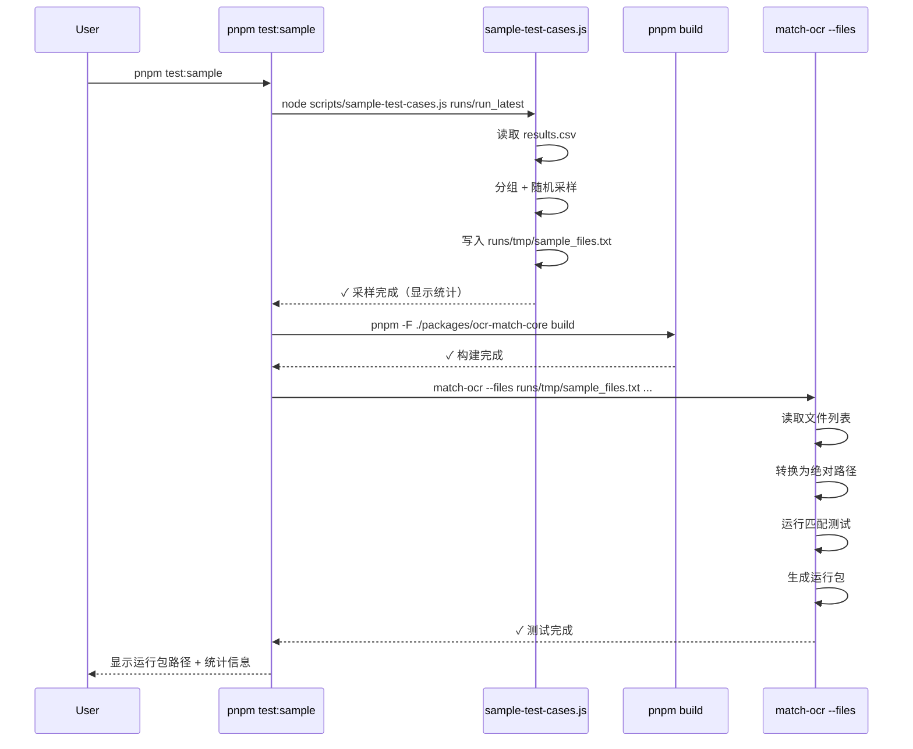

# Design Document

## Overview

Sample Testing 功能通过从 baseline 测试运行包中提取分层采样（stratified sampling），将测试时间从 38 分钟压缩至 2-3 分钟。核心设计包括三个独立模块：

1. **采样脚本**（`scripts/sample-test-cases.js`）- 从 results.csv 提取代表性样本
2. **CLI 文件列表支持**（`match-ocr.ts` 新增 `--files` 参数）- 支持按文件列表运行测试
3. **测试流程编排**（`package.json` scripts）- 一键执行完整采样测试流程

**设计原则**：
- **零依赖注入** - 采样脚本使用 Node.js 内置模块，不引入新依赖
- **向后兼容** - CLI 新增参数为可选，不影响现有用法
- **单一职责** - 每个模块只做一件事并做好

## Steering Document Alignment

### Technical Standards (tech.md)

本设计遵循项目的核心技术原则：

**Monorepo Philosophy** - "两个项目、一套真理"
- ✅ 采样脚本位于 `scripts/` - monorepo 共享工具层
- ✅ CLI 修改位于 `packages/ocr-match-core/` - 核心包
- ✅ 根目录 `package.json` 提供统一入口 (`pnpm test:sample`)

**Configuration Immutability** - 配置版本化和不可变性
- ✅ 采样脚本读取 `configs/latest.json` 指针，不修改历史配置
- ✅ 生成的运行包遵循 Run Bundle Structure 契约
- ✅ 采样配置（`SAMPLE_CONFIG`）集中管理，便于版本控制

**Processing Pipeline** - 四阶段处理不变
- ✅ 采样测试不修改 normalize/extract/match/bucketize 流程
- ✅ 仅控制输入样本数量（222 → 35-40）

### Project Structure (structure.md)

```
terminal-gd/
├── scripts/
│   └── sample-test-cases.js       # 新增：采样脚本（独立可运行）
├── packages/
│   └── ocr-match-core/
│       ├── src/cli/
│       │   └── match-ocr.ts       # 修改：新增 --files 参数
│       └── package.json           # 修改：新增 test:sample script
├── runs/
│   ├── run_latest -> run_20251117_10_44/  # 符号链接指向 baseline
│   ├── run_20251117_10_44/        # Baseline 运行包
│   ├── run_sample_20251117_1430/  # 采样测试运行包
│   └── tmp/
│       └── sample_files.txt       # 采样文件列表（临时文件）
├── docs/
│   └── TEST_GUIDE.md              # 修改：新增 Sample Testing 章节
└── package.json                   # 修改：新增根目录 test:sample script
```

## Code Reuse Analysis

### Existing Components to Leverage

- **`packages/ocr-match-core/src/cli/match-ocr.ts`**：
  - 复用现有 CLI 参数解析（`yargs`）
  - 复用 `--ocr` 目录扫描逻辑（改为可选）
  - 复用 `{timestamp}` 占位符替换逻辑

- **`packages/ocr-match-core/src/cli/build-index.ts`**：
  - 参考 CSV 读取模式（但不依赖，因为采样脚本在 monorepo 根目录）

- **`scripts/update-docs.js`**：
  - 参考 Node.js 脚本组织模式（CLI 参数解析、文件读写）

- **`runs/run_*` 运行包结构**：
  - 复用 `results.csv` 列契约（`filename,bucket,reason,...`）
  - 复用 `manifest.json` 元数据结构

### Integration Points

- **现有测试脚本**（`pnpm test:full`, `pnpm test:quick`）：
  - `test:sample` 作为第三种测试模式，参数模板类似 `test:full`

- **运行包契约**（`results.csv` 列定义）：
  - 采样脚本依赖 `bucket` 和 `reason` 字段
  - 不修改列定义，保持向后兼容

- **Monorepo 脚本层**：
  - 根目录 `package.json` 通过 `pnpm -F` 调用子包命令

## Architecture

### Modular Design Principles

**Single File Responsibility**：
- `sample-test-cases.js` - 仅负责 CSV 解析、分组、随机采样
- `match-ocr.ts` - 仅添加文件列表输入模式，不改变匹配逻辑
- `package.json` scripts - 仅负责流程编排（sample → build → test）

**Component Isolation**：
- 采样脚本可独立运行：`node scripts/sample-test-cases.js <run_dir>`
- CLI 参数独立：`--files` 不依赖其他新参数
- 符号链接解耦：`run_latest` 让用户控制 baseline 版本

**Service Layer Separation**：
- **数据层**：CSV 文件读写（采样脚本）
- **业务层**：采样逻辑（`SAMPLE_CONFIG` + 随机抽样）
- **编排层**：Shell 脚本组合（`package.json` scripts）

### Data Flow

```mermaid
graph TD
    A[Baseline 运行包<br/>run_latest/results.csv] -->|1. 读取| B[采样脚本<br/>sample-test-cases.js]
    B -->|2. CSV 解析| C[按 bucket/reason 分组]
    C -->|3. 随机采样| D[文件列表<br/>runs/tmp/sample_files.txt]
    D -->|4. --files 参数| E[CLI 工具<br/>match-ocr.ts]
    E -->|5. 运行测试| F[新运行包<br/>run_sample_{timestamp}/]
    F -->|6. 生成| G[results.csv<br/>summary.md<br/>manifest.json]

    style A fill:#e1f5ff
    style D fill:#fff3cd
    style F fill:#d4edda
```

### Execution Flow



## Components and Interfaces

### Component 1: 采样脚本 (sample-test-cases.js)

**Purpose**: 从 baseline 运行包中提取分层随机样本

**Interfaces**:
```javascript
// CLI 接口
node scripts/sample-test-cases.js <run_dir>

// 输入：
//   <run_dir>: 运行包目录路径（如 runs/run_20251117_10_44）

// 输出：
//   runs/tmp/sample_files.txt - 文件列表（每行一个文件名）
//   stdout - 采样统计信息

// 配置：
const SAMPLE_CONFIG = {
  exact: 5,
  review: 5,
  fail: {
    EXTRACT_EMPTY_SUPPLIER: 5,
    FIELD_SIM_LOW_SUPPLIER: 5,
    NO_CANDIDATE: 3,
    DELTA_TOO_SMALL: 3,
    default: 3  // 其他 reason
  }
};
```

**Dependencies**:
- Node.js 内置模块：`fs`, `path`
- 无外部依赖

**Key Functions**:
```javascript
// 读取 CSV 文件
function parseResultsCSV(filePath) {
  // 返回：[{ filename, bucket, reason, ... }, ...]
}

// 按 bucket 和 reason 分组
function groupByBucketAndReason(results) {
  // 返回：{ 'exact': [...], 'review': [...], 'fail|NO_CANDIDATE': [...], ... }
}

// 随机采样
function sampleFromGroup(items, count) {
  // 洗牌算法 + 取前 count 项
  // 返回：采样后的 items 数组
}

// 生成文件列表
function writeFileList(samples, outputPath) {
  // 写入 runs/tmp/sample_files.txt（每行一个 filename）
}
```

**Error Handling**:
- `run_dir` 不存在 → 错误退出，显示使用说明
- `results.csv` 不存在 → 错误退出："results.csv not found in {run_dir}"
- CSV 格式错误 → 错误退出："Invalid CSV format"

### Component 2: CLI 文件列表支持 (match-ocr.ts 修改)

**Purpose**: 支持通过文件列表（而非目录扫描）运行测试

**Interfaces**:
```typescript
// 新增 CLI 参数
--files <path>  // 文件列表路径（如 runs/tmp/sample_files.txt）

// 行为变化：
// IF --files 存在：
//   - 跳过 --ocr 目录扫描
//   - 读取文件列表（每行一个文件名）
//   - 转换为绝对路径（相对于 --ocr 目录）
//   - 验证文件存在性
// ELSE:
//   - 保持现有逻辑（扫描 --ocr 目录）
```

**Dependencies**:
- 现有依赖：`yargs`, `fs`, `path`
- 复用现有函数：`scanOcrDirectory()` 的路径处理逻辑

**Code Changes** (预估修改点):
```typescript
// 1. 新增参数定义（~第 50-60 行）
.option('files', {
  type: 'string',
  description: 'File list to process (one filename per line)',
  conflicts: 'ocr'  // --files 和 --ocr 互斥？NO，需要 --ocr 作为基准目录
})

// 2. 修改文件获取逻辑（~第 180-200 行）
let ocrFiles: string[];

if (args.files) {
  logger.info('cli.match-ocr', `Loading file list from: ${args.files}`);
  const fileListContent = fs.readFileSync(args.files, 'utf-8');
  const filenames = fileListContent.split('\n')
    .map(line => line.trim())
    .filter(line => line.length > 0);

  // 转换为绝对路径
  ocrFiles = filenames.map(filename => path.join(args.ocr, filename));

  // 验证文件存在
  const missingFiles = ocrFiles.filter(f => !fs.existsSync(f));
  if (missingFiles.length > 0) {
    logger.error('cli.match-ocr', `Missing files:\n${missingFiles.join('\n')}`);
    throw new Error(`${missingFiles.length} files not found`);
  }

  logger.info('cli.match-ocr', `✓ Loaded ${ocrFiles.length} files from list`);
} else {
  // 现有逻辑：扫描目录
  ocrFiles = scanOcrDirectory(args.ocr);
  logger.info('cli.match-ocr', `✓ Scanned ${ocrFiles.length} files from directory`);
}
```

**Reuses**:
- `path.join()` - 路径拼接逻辑
- `fs.existsSync()` - 文件存在性检查
- 现有日志框架 - `logger.info()`, `logger.error()`

### Component 3: 测试流程编排 (package.json scripts)

**Purpose**: 一键执行"采样 → 构建 → 测试"完整流程

**Interfaces**:
```bash
# 根目录（推荐）
pnpm test:sample

# 等价于（手动执行）
node scripts/sample-test-cases.js runs/run_latest && \
pnpm -F ./packages/ocr-match-core build && \
pnpm -F ./packages/ocr-match-core match-ocr \
  --ocr ./data/ocr_txt \
  --index ./runs/tmp/index_p0_v3.json \
  --out ./runs/run_sample_{timestamp} \
  --config . \
  --db ./data/db \
  --files ./runs/tmp/sample_files.txt \
  --autoPass 0.7 --minFieldSim 0.6 --minDeltaTop 0.03 --topk 3
```

**Dependencies**:
- `pnpm` workspace filter (`-F`)
- Node.js 执行环境
- `runs/run_latest` 符号链接

**Error Handling**:
- `runs/run_latest` 不存在 → 脚本失败，提示创建符号链接
- 采样脚本失败 → 流程中断，不执行后续步骤
- 构建失败 → 流程中断
- 测试失败 → 生成失败运行包（符合现有行为）

**Code Changes**:
```json
// 根目录 package.json
{
  "scripts": {
    "test:sample": "node scripts/sample-test-cases.js runs/run_latest && pnpm -F ./packages/ocr-match-core build && pnpm -F ./packages/ocr-match-core match-ocr --ocr ./data/ocr_txt --index ./runs/tmp/index_p0_v3.json --out ./runs/run_sample_{timestamp} --config . --db ./data/db --files ./runs/tmp/sample_files.txt --autoPass 0.7 --minFieldSim 0.6 --minDeltaTop 0.03 --topk 3"
  }
}

// packages/ocr-match-core/package.json（可选，便于调试）
{
  "scripts": {
    "sample": "node ../../scripts/sample-test-cases.js ../../runs/run_latest",
    "test:sample": "pnpm sample && pnpm build && pnpm match-ocr --ocr ../../data/ocr_txt --index ../../runs/tmp/index_p0_v3.json --out ../../runs/run_sample_{timestamp} --config ../.. --db ../../data/db --files ../../runs/tmp/sample_files.txt --autoPass 0.7 --minFieldSim 0.6 --minDeltaTop 0.03 --topk 3"
  }
}
```

## Data Models

### 输入：results.csv (Baseline 运行包)

**格式**（现有契约，不可修改）：
```csv
filename,bucket,reason,match_db_file,match_id,match_score,field_0_score,field_1_score,...
WechatIMG3671.txt,exact,,-,供应商ABC,0.95,0.90,1.00,...
WechatIMG3672.txt,fail,EXTRACT_EMPTY_SUPPLIER,-,-,0,0,0,...
WechatIMG3673.txt,review,DELTA_TOO_SMALL,db1.xlsx,供应商DEF,0.75,0.70,0.80,...
```

**关键字段**：
- `filename` - OCR 文本文件名（相对于 `--ocr` 目录）
- `bucket` - 分桶结果（`exact` / `review` / `fail`）
- `reason` - 失败原因（仅 `fail` 时有值）

### 中间产物：sample_files.txt

**格式**：
```
WechatIMG3671.txt
WechatIMG3675.txt
WechatIMG3680.txt
...
```

**约束**：
- 每行一个文件名
- 文件名相对于 `--ocr` 目录
- UTF-8 编码
- Unix 换行符（\n）

### 输出：运行包 (run_sample_{timestamp}/)

**格式**（遵循现有契约）：
```
run_sample_20251117_1430/
├── manifest.json       # 元数据（包含 sample_source 字段）
├── summary.md          # 执行总结
├── results.csv         # 测试结果（35-40 行）
└── log.jsonl           # 结构化日志
```

**manifest.json 扩展**（可选增强）：
```json
{
  "version": "v0.1.6",
  "config_version": "v0.1.0",
  "config_sha": "abc123",
  "db_digest": "def456",
  "timestamp": "2025-11-17T14:30:00.000Z",
  "sample_mode": true,                    // 新增：标识这是采样测试
  "sample_source": "run_20251117_10_44",  // 新增：来源 baseline
  "sample_count": 38,                     // 新增：采样数量
  "params": { ... }
}
```

## Error Handling

### Error Scenarios

#### 1. Baseline 运行包不存在

**Scenario**: 用户执行 `pnpm test:sample`，但 `runs/run_latest` 符号链接不存在或指向无效路径

**Handling**:
```javascript
// sample-test-cases.js
if (!fs.existsSync(runDir)) {
  console.error(`Error: Baseline run directory does not exist: ${runDir}`);
  console.error(`Please create a symlink: ln -s run_YYYYmmdd_HHMMSS runs/run_latest`);
  process.exit(1);
}
```

**User Impact**:
- 脚本立即退出，显示错误和修复建议
- 不执行后续构建和测试

#### 2. results.csv 格式错误

**Scenario**: `results.csv` 缺少 `bucket` 或 `reason` 列

**Handling**:
```javascript
// sample-test-cases.js
function parseResultsCSV(filePath) {
  const lines = fs.readFileSync(filePath, 'utf-8').split('\n');
  const header = lines[0].split(',');

  if (!header.includes('filename') || !header.includes('bucket') || !header.includes('reason')) {
    throw new Error(`Invalid CSV format: missing required columns (filename, bucket, reason)`);
  }

  // ... 继续解析
}
```

**User Impact**:
- 脚本退出，显示清晰错误信息
- 提示用户检查 baseline 运行包是否完整

#### 3. 文件列表中的文件不存在

**Scenario**: `sample_files.txt` 中包含不存在的 OCR 文件（baseline 和当前 `--ocr` 目录不一致）

**Handling**:
```typescript
// match-ocr.ts
const missingFiles = ocrFiles.filter(f => !fs.existsSync(f));
if (missingFiles.length > 0) {
  logger.error('cli.match-ocr', `Missing files:\n${missingFiles.join('\n')}`);
  logger.error('cli.match-ocr', `Ensure --ocr directory matches the baseline run's OCR source`);
  throw new Error(`${missingFiles.length} files not found`);
}
```

**User Impact**:
- CLI 退出，显示缺失文件列表
- 提示用户检查 `--ocr` 目录是否正确

#### 4. 采样数量不足

**Scenario**: Baseline 中某个类别只有 2 条记录，但 `SAMPLE_CONFIG` 要求采样 5 条

**Handling**:
```javascript
// sample-test-cases.js
function sampleFromGroup(items, count) {
  if (items.length <= count) {
    console.warn(`  Warning: Only ${items.length} items available, using all`);
    return items;  // 全部采样
  }

  // ... 随机采样逻辑
}
```

**User Impact**:
- 警告信息，但不影响执行
- 采样该类别的全部记录

## Testing Strategy

### Unit Testing

**采样脚本测试**（手动验证）：
```bash
# 准备测试数据
mkdir -p runs/test_baseline
cat > runs/test_baseline/results.csv << 'EOF'
filename,bucket,reason,match_db_file,match_id,match_score
file1.txt,exact,,-,A,0.95
file2.txt,exact,,-,B,0.92
file3.txt,review,DELTA_TOO_SMALL,db.xlsx,C,0.75
file4.txt,fail,NO_CANDIDATE,-,-,0
file5.txt,fail,EXTRACT_EMPTY_SUPPLIER,-,-,0
EOF

# 运行采样脚本
node scripts/sample-test-cases.js runs/test_baseline

# 验证输出
cat runs/tmp/sample_files.txt
# 预期：包含 3-5 个文件名
```

**CLI 参数测试**（手动验证）：
```bash
# 构建最新代码
pnpm -F ./packages/ocr-match-core build

# 准备测试文件列表
cat > runs/tmp/test_files.txt << 'EOF'
WechatIMG3671.txt
WechatIMG3672.txt
EOF

# 运行 CLI
pnpm -F ./packages/ocr-match-core match-ocr \
  --ocr ./data/ocr_txt \
  --index ./runs/tmp/index_p0_v3.json \
  --out ./runs/test_files_mode \
  --config . \
  --allow-stale-index \
  --files ./runs/tmp/test_files.txt

# 验证：
# 1. 只处理了 2 个文件
# 2. results.csv 只有 2 行数据
# 3. manifest.json 记录正确
```

### Integration Testing

**完整流程测试**：
```bash
# 1. 创建 baseline 符号链接
ln -sf run_20251117_10_44 runs/run_latest

# 2. 运行采样测试
pnpm test:sample

# 3. 验证：
# - runs/tmp/sample_files.txt 存在且包含 30-40 行
# - runs/run_sample_<timestamp>/ 目录创建成功
# - results.csv 包含 30-40 行数据
# - summary.md 显示 exact/review/fail 分布
# - manifest.json 包含 sample_mode 字段
```

**对比测试**（验证加速效果）：
```bash
# 1. 完整测试
time pnpm test:full
# 预期：~38 分钟

# 2. 采样测试
time pnpm test:sample
# 预期：2-3 分钟

# 3. 对比结果分布
diff -u runs/run_latest/summary.md runs/run_sample_<timestamp>/summary.md
# 预期：分布比例相似（±10%）
```

### End-to-End Testing

**用户场景 1：算法改进后快速验证**
```bash
# 1. 修改代码（如 bucketize.ts）
vim packages/ocr-match-core/src/bucket/bucketize.ts

# 2. 快速验证
pnpm test:sample
# 预期：2-3 分钟内完成，显示 exact/review/fail 分布

# 3. 如果采样测试通过，运行完整测试
pnpm test:full
```

**用户场景 2：参数调优**
```bash
# 1. 修改 SAMPLE_CONFIG（增加采样数）
vim scripts/sample-test-cases.js
# exact: 5 → 10

# 2. 重新采样测试
pnpm test:sample

# 3. 验证采样数量增加
wc -l runs/tmp/sample_files.txt
# 预期：~70 行（之前 ~35 行）
```

**用户场景 3：灾难回归检测（模拟 v0.1.7）**
```bash
# 1. 建立 baseline
pnpm test:full
ln -sf run_20251117_1044 runs/run_latest

# 2. 引入错误（故意破坏代码）
vim packages/ocr-match-core/src/extract/extractor.ts
# 删除关键逻辑

# 3. 快速检测
pnpm test:sample
# 预期：2-3 分钟内发现 exact 大幅下降

# 4. 立即回滚，避免完整测试浪费时间
git checkout packages/ocr-match-core/src/extract/extractor.ts
```

## Security and Performance Considerations

### Security

- **路径注入防护**：
  - `sample-test-cases.js` 使用 `path.join()` 拼接路径，防止路径穿越
  - CLI `--files` 参数验证文件存在性，拒绝访问 `--ocr` 目录外的文件

- **资源限制**：
  - 采样脚本读取 CSV 大小限制（如 `results.csv` < 10MB）
  - 文件列表行数限制（如 `sample_files.txt` < 1000 行）

### Performance

**采样脚本性能**：
- CSV 解析：流式读取（如文件 > 10MB）或一次性读取（< 10MB）
- 随机采样：洗牌算法 O(n)，n ≈ 222，耗时 < 1ms
- 文件写入：同步写入，耗时 < 10ms
- **总耗时**：< 1 秒

**CLI 文件列表模式性能**：
- 文件列表读取：同步读取，35-40 行，耗时 < 10ms
- 路径拼接：35-40 次 `path.join()`，耗时 < 1ms
- 文件存在性检查：35-40 次 `fs.existsSync()`，耗时 < 50ms
- **总额外开销**：< 100ms（相比目录扫描节省 ~500ms）

**端到端性能**：
- 采样：< 1 秒
- 构建：~10 秒（取决于 TypeScript 编译缓存）
- 测试：2-3 分钟（35-40 样本）
- **总耗时**：2.5-3.5 分钟（相比 38 分钟加速 12 倍）

## Rollout Plan

### Phase 1: 核心功能实现
- 实现 `sample-test-cases.js`
- 修改 `match-ocr.ts` 添加 `--files` 参数
- 手动测试验证

### Phase 2: 脚本集成
- 添加 `package.json` scripts
- 创建 `runs/run_latest` 符号链接
- 端到端测试

### Phase 3: 文档和发布
- 更新 `docs/TEST_GUIDE.md`
- 更新 `CLAUDE.md` 添加 Sample Testing 说明
- 创建 v0.1.7-retry 发布（假设采样测试验证通过）

## Future Enhancements

**可选增强**（不在当前 scope）：
1. **智能采样**：基于历史失败率调整采样比例（如 EXTRACT_EMPTY_SUPPLIER 失败率高 → 多采样）
2. **多 baseline 对比**：支持对比多个运行包的采样结果
3. **采样报告**：生成采样覆盖率报告（如"覆盖 5/7 个 fail reason"）
4. **增量采样**：仅采样自上次 baseline 以来新增的失败类型
