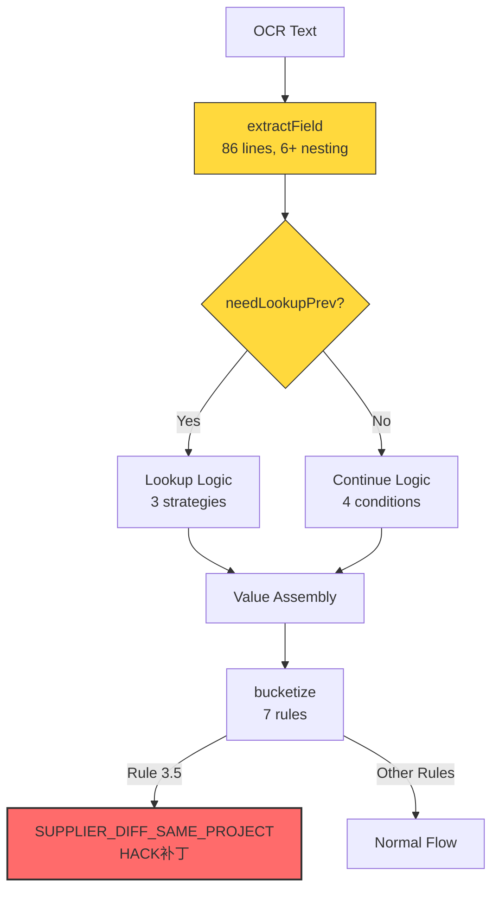
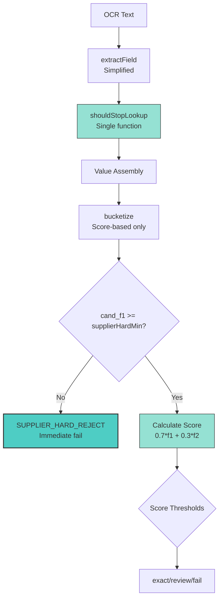

# Design Document

## Overview

**核心洞察（Linus Torvalds 视角）**：

当前系统的根本问题不是算法逻辑，而是**数据结构设计错误**。

> "Bad programmers worry about the code. Good programmers worry about data structures and their relationships."

**症状**：
- `SUPPLIER_DIFF_SAME_PROJECT` 作为一个"原因"存在 → 这是对数据模型错误的补丁
- `extractField()` 有 86 行 + 6 层嵌套 → 数据结构混乱导致的特殊情况处理
- `bucketize()` 有 7 条规则的 if-else 瀑布 → 缺少正确的阈值抽象

**根本原因**：
1. `LabelAliasConfig` 混合了提取标签和噪点标签（供应商联系人 vs 供应商）
2. `BucketConfig` 没有供应商硬阈值（supplierHardMin）和权重（weights）
3. 没有文档字段标签黑名单（document_field_labels）
4. 没有表格边界检测（table_header_keywords）

**解决方案**：修复数据结构，特殊情况自然消失。

---

## Steering Document Alignment

### Technical Standards (tech.md)

本设计遵循项目核心技术原则：

1. **配置不可变性**：创建新版本 `configs/v0.1.7/<sha>/`，永不修改 `v0.labs`
2. **向后兼容**：`results.csv` 列契约不变，旧配置继续可用
3. **运行包结构**：manifest.json 记录 `config_version` 和 `config_sha`

### Project Structure (structure.md)

遵循 Monorepo 结构：

```
packages/ocr-match-core/src/
├── extract/extractor.ts       # Part A: 提取逻辑修复
├── bucket/bucketize.ts        # Part B: 分桶逻辑优化
├── bucket/reasons.ts          # Part B: 失败原因更新
├── config/schema.ts           # 配置类型扩展
└── config/load.ts             # 配置加载增强

configs/
├── v0.labs/e7bef887/          # 旧版本（只读）
└── v0.1.7/<new-sha>/          # 新版本
    ├── label_alias.json       # 清理后的标签配置
    ├── domain.json            # 扩展的领域配置
    ├── bucketize.json         # 新阈值参数（新增）
    └── normalize.user.json    # 归一化配置（复制）
```

---

## Code Reuse Analysis

### Existing Components to Leverage

- **`normalize/pipeline.ts`**：文本归一化管线，无需修改
- **`match/similarity.ts`**：相似度计算，无需修改
- **`match/rank.ts`**：候选排名，无需修改
- **`config/load.ts`**：配置加载，扩展以支持新字段
- **`report/writer.ts`**：报告生成，无需修改（reason 字段支持新值）

### Integration Points

- **配置系统**：扩展 `DomainConfigSchema` 和新增 `BucketizeConfigSchema`
- **提取器**：`extractField()` 使用新的 `document_field_labels` 和 `table_header_keywords`
- **分桶器**：`bucketize()` 使用新的 `supplierHardMin` 和 `weights`

---

## Architecture

**设计哲学**：消除特殊情况，而非处理特殊情况。

> "Sometimes you can see a problem in a different way and rewrite it so that the special case goes away and becomes the normal case."

### 当前架构（有问题）



### 新架构（修复后）



### Modular Design Principles

#### 1. Single File Responsibility

- **extractor.ts**：只负责从文本提取字段（行扫描 + 值组装）
- **bucketize.ts**：只负责分桶决策（阈值比较 + 分类）
- **schema.ts**：只负责类型定义（配置验证）
- **每个配置文件**：只存储一类配置（label_alias / domain / bucketize）

#### 2. Component Isolation

新增独立函数（消除嵌套）：

```typescript
// extractor.ts - 新增函数（每个 < 20 行）
shouldStopLookup(line, currentFieldLabels, allFieldLabels, documentFieldLabels) → boolean
isTableHeader(line, tableHeaderKeywords) → boolean
assembleValue(currentValue, prevLine, nextLine) → string

// bucketize.ts - 新增函数（每个 < 10 行）
applySupplierHardThreshold(f1_score, supplierHardMin) → boolean
calculateWeightedScore(f1_score, f2_score, weights) → number
```

#### 3. Service Layer Separation

- **配置层**：schema.ts（类型定义）+ load.ts（加载验证）
- **业务逻辑层**：extractor.ts + bucketize.ts
- **报告层**：writer.ts（不变）

#### 4. Utility Modularity

所有阈值从配置读取，零硬编码：

```typescript
// 旧代码（硬编码魔数）
if (top1.f2_score >= 0.75 && top1.f1_score >= 0.40 && top1.f1_score < 0.65) {
  return { bucket: 'review', reason: FailReason.SUPPLIER_DIFF_SAME_PROJECT };
}

// 新代码（配置驱动）
if (cand_f1 < config.supplierHardMin) {
  return { bucket: 'fail', reason: FailReason.SUPPLIER_HARD_REJECT };
}
const score = config.weights[0] * cand_f1 + config.weights[1] * cand_f2;
if (score >= config.autoPass) {
  return { bucket: 'exact', reason: null };
}
```

---

## Components and Interfaces

### Component 1: Enhanced Domain Configuration

- **Purpose**: 扩展领域配置以支持文档字段排除和表格边界检测
- **File**: `packages/ocr-match-core/src/config/schema.ts`
- **Interfaces**:
  ```typescript
  // 扩展 DomainConfigSchema
  export const DomainConfigSchema = z.object({
    anchors: z.object({ project: z.array(z.string()).default([]) }).partial().optional().default({}),
    noise_words: z.array(z.string()).default([]),
    stopwords: z.array(z.string()).default([]),
    // 新增
    document_field_labels: z.array(z.string()).default([]),  // 噪点字段标签
    table_header_keywords: z.array(z.string()).default([]),  // 表格表头关键词
  });
  ```
- **Dependencies**: Zod validation library
- **Reuses**: Existing schema pattern

### Component 2: Bucketize Configuration

- **Purpose**: 将分桶阈值从硬编码移至配置文件
- **File**: `packages/ocr-match-core/src/config/schema.ts`（新增）
- **Interfaces**:
  ```typescript
  // 新增 BucketizeConfigSchema
  export const BucketizeConfigSchema = z.object({
    supplierHardMin: z.number().min(0).max(1).default(0.58),
    autoPass: z.number().min(0).max(1).default(0.75),
    minReview: z.number().min(0).max(1).default(0.65),
    minFieldSim: z.number().min(0).max(1).default(0.60),
    minDeltaTop: z.number().min(0).max(1).default(0.03),
    weights: z.tuple([z.number(), z.number()]).default([0.7, 0.3]),
  }).refine(
    (data) => data.supplierHardMin <= data.minReview && data.minReview <= data.autoPass,
    { message: "Must have supplierHardMin <= minReview <= autoPass" }
  ).refine(
    (data) => Math.abs(data.weights[0] + data.weights[1] - 1.0) < 0.001,
    { message: "Weights must sum to 1.0" }
  );

  export type BucketizeConfig = z.infer<typeof BucketizeConfigSchema>;
  ```
- **Dependencies**: Zod validation library
- **Reuses**: Existing schema pattern with refinement for business rules

### Component 3: Enhanced Extractor

- **Purpose**: 消除提取逻辑中的特殊情况，使用配置驱动的停止条件
- **File**: `packages/ocr-match-core/src/extract/extractor.ts`
- **Interfaces**:
  ```typescript
  export interface ExtractConfig {
    label_alias: LabelAliasConfig;
    domain: DomainConfig; // 现在包含 document_field_labels 和 table_header_keywords
    normalize: NormalizeConfig;
  }

  // 新增独立函数
  function shouldStopLookup(
    line: string,
    currentFieldLabels: string[],
    allFieldLabels: string[],
    documentFieldLabels: string[]
  ): boolean;

  function isTableHeader(line: string, keywords: string[]): boolean;
  ```
- **Dependencies**: DomainConfig（扩展后）
- **Reuses**: normalize pipeline

### Component 4: Simplified Bucketizer

- **Purpose**: 消除 SUPPLIER_DIFF_SAME_PROJECT hack，使用纯分数逻辑
- **File**: `packages/ocr-match-core/src/bucket/bucketize.ts`
- **Interfaces**:
  ```typescript
  // 更新 BucketConfig 接口
  export interface BucketConfig {
    supplierHardMin: number;  // 新增：供应商硬阈值
    autoPass: number;         // 提高：0.70 → 0.75
    minReview: number;        // 新增：review 最低分
    minFieldSim: number;      // 保留
    minDeltaTop: number;      // 保留
    weights: [number, number]; // 新增：[0.7, 0.3]
  }

  // 新增辅助函数
  function applySupplierHardThreshold(f1_score: number, supplierHardMin: number): boolean;
  function calculateWeightedScore(f1_score: number, f2_score: number, weights: [number, number]): number;
  ```
- **Dependencies**: BucketizeConfig（从配置加载）
- **Reuses**: ScoredCandidate 类型

### Component 5: Updated Failure Reasons

- **Purpose**: 移除 hack 原因，添加清晰的失败原因
- **File**: `packages/ocr-match-core/src/bucket/reasons.ts`
- **Interfaces**:
  ```typescript
  export enum FailReason {
    // 保留
    EXTRACT_EMPTY_SUPPLIER,
    EXTRACT_EMPTY_PROJECT,
    EXTRACT_BOTH_EMPTY,
    NO_CANDIDATES,
    FIELD_SIM_LOW_SUPPLIER,
    FIELD_SIM_LOW_PROJECT,
    DELTA_TOO_SMALL,
    SCORE_BELOW_AUTO_PASS,

    // 移除
    // SUPPLIER_DIFF_SAME_PROJECT,  ← 删除此行

    // 新增
    SUPPLIER_HARD_REJECT = 'SUPPLIER_HARD_REJECT',  // 供应商相似度低于硬阈值
    SCORE_TOO_LOW = 'SCORE_TOO_LOW',                // 综合分数过低
    SCORE_BORDERLINE = 'SCORE_BORDERLINE',          // 分数在 review 区间
  }
  ```
- **Dependencies**: None
- **Reuses**: Existing enum pattern

---

## Data Models

### Model 1: Cleaned Label Alias Configuration

```json
{
  "supplier": [
    "供应商",      // 202/222 (91.0%) - 主标签
    "供应尚",      // OCR 错误变体（"商"→"尚"）
    "侯应商"       // OCR 错误变体（"供"→"侯"）
  ],
  "project": [
    "工程名称",    // 207/222 (93.2%) - 主标签
    "工理名称",    // OCR 错误变体（"程"→"理"）
    "工程名杆",    // OCR 错误变体（"称"→"杆"）
    "T.程名称",    // 1/222 真实 OCR 错误
    "丁程名称"     // OCR 错误变体（"工"→"丁"）
  ],
  "_dbColumnNames": {
    "supplier": ["合同执行单位"],
    "project": ["单体工程名称"],
    "order": ["订单号", "订号"]
  }
}
```

**数据结构真理**：
- ✅ 只包含提取目标字段的标签
- ✅ 包含合理的 OCR 错误变体
- ❌ 不包含噪点字段（供应商联系人）
- ❌ 不包含不存在的标签（供应单位名称）

### Model 2: Extended Domain Configuration

```json
{
  "anchors": {
    "project": ["工程", "项目", "线路", "站"]
  },
  "noise_words": [
    "验收情况",
    "备注",
    "报装编号",
    "P2",
    "实际到货"
  ],
  "stopwords": [],
  "document_field_labels": [
    "项目管理单位",
    "报装编号",
    "到货验收单号",
    "订货通知单号",
    "供应商联系人",
    "供应商联系方式",
    "承运商联系人",
    "收货联系人",
    "交货地点",
    "支付方式",
    "验收情况",
    "备注"
  ],
  "table_header_keywords": [
    "序号",
    "物资名称",
    "单位",
    "规格型号及技术参数",
    "计划数量",
    "计划交货期"
  ]
}
```

**数据结构真理**：
- `noise_words`：截断关键词（见到就停）
- `document_field_labels`：噪点字段标签（跨字段边界）
- `table_header_keywords`：表格检测（停止向下查找）

### Model 3: New Bucketize Configuration

```json
{
  "supplierHardMin": 0.58,
  "autoPass": 0.75,
  "minReview": 0.65,
  "minFieldSim": 0.60,
  "minDeltaTop": 0.03,
  "weights": [0.7, 0.3]
}
```

**数据结构真理**：
- `supplierHardMin < minReview < autoPass`（硬约束）
- `weights[0] + weights[1] = 1.0`（权重和为 1）
- 供应商是 primary key（70% 权重），项目是 secondary check（30% 权重）

---

## Error Handling

### Error Scenarios

#### 1. Configuration Validation Failure

- **Description**: 新配置文件 Zod 校验失败（如 weights 和不为 1.0）
- **Handling**:
  ```typescript
  try {
    const config = BucketizeConfigSchema.parse(rawConfig);
  } catch (e) {
    if (e instanceof z.ZodError) {
      logger.error(`Config validation failed: ${e.errors.map(e => e.message).join(', ')}`);
      // 回退到默认配置
      return DEFAULT_BUCKETIZE_CONFIG;
    }
  }
  ```
- **User Impact**: 警告日志 + 使用默认配置（不中断服务）

#### 2. Empty Extraction with Ground Truth Mismatch

- **Description**: 提取结果为空，但 sidecar 有正确值
- **Handling**:
  ```typescript
  const extracted = extract(text, config);
  const sidecar = loadSidecar(filename);
  if (!extracted.q_supplier && sidecar.fields['供应商']) {
    logger.warn(`EXTRACT_MISS: ${filename} - expected ${sidecar.fields['供应商']}`);
    warns.push('EXTRACT_MISS_SUPPLIER');
  }
  ```
- **User Impact**: 详细警告日志，测试失败（不静默）

#### 3. Hard Threshold Rejection

- **Description**: 供应商相似度低于 `supplierHardMin`
- **Handling**:
  ```typescript
  if (top1.f1_score < config.supplierHardMin) {
    logger.info(`SUPPLIER_HARD_REJECT: ${q_supplier} vs ${top1.s_f1} (${top1.f1_score.toFixed(2)} < ${config.supplierHardMin})`);
    return { bucket: 'fail', reason: FailReason.SUPPLIER_HARD_REJECT };
  }
  ```
- **User Impact**: 清晰的失败原因，日志包含实际值

#### 4. Configuration File Not Found

- **Description**: `configs/v0.1.7/<sha>/bucketize.json` 不存在
- **Handling**:
  ```typescript
  const bucketizePath = path.join(configRoot, 'bucketize.json');
  if (!fs.existsSync(bucketizePath)) {
    logger.warn(`bucketize.json not found at ${bucketizePath}, using defaults`);
    return DEFAULT_BUCKETIZE_CONFIG;
  }
  ```
- **User Impact**: 警告 + 使用默认配置（向后兼容）

---

## Testing Strategy

### Unit Testing

#### 1. Configuration Schema Tests

```typescript
// config/schema.test.ts
describe('BucketizeConfigSchema', () => {
  test('validates correct config', () => {
    const config = { supplierHardMin: 0.58, autoPass: 0.75, minReview: 0.65, weights: [0.7, 0.3] };
    expect(() => BucketizeConfigSchema.parse(config)).not.toThrow();
  });

  test('rejects invalid weight sum', () => {
    const config = { weights: [0.6, 0.3] }; // sum = 0.9
    expect(() => BucketizeConfigSchema.parse(config)).toThrow('Weights must sum to 1.0');
  });

  test('rejects invalid threshold order', () => {
    const config = { supplierHardMin: 0.70, minReview: 0.65, autoPass: 0.75 };
    expect(() => BucketizeConfigSchema.parse(config)).toThrow('supplierHardMin <= minReview');
  });
});
```

#### 2. Extraction Stop Logic Tests

```typescript
// extract/extractor.test.ts
describe('shouldStopLookup', () => {
  const documentFieldLabels = ['项目管理单位', '供应商联系人'];
  const supplierLabels = ['供应商'];
  const projectLabels = ['工程名称'];
  const allLabels = [...supplierLabels, ...projectLabels];

  test('stops on document field label', () => {
    const line = '项目管理单位：检修分公司综合室';
    expect(shouldStopLookup(line, supplierLabels, allLabels, documentFieldLabels)).toBe(true);
  });

  test('stops on other field label', () => {
    const line = '工程名称：武汉市轨道交通';
    expect(shouldStopLookup(line, supplierLabels, allLabels, documentFieldLabels)).toBe(true);
  });

  test('stops on entity word ending', () => {
    const line = '武汉星火电线电缆有限公司';
    expect(shouldStopLookup(line, supplierLabels, allLabels, documentFieldLabels)).toBe(true);
  });

  test('continues on normal text', () => {
    const line = '武汉市轨道交通19号线';
    expect(shouldStopLookup(line, supplierLabels, allLabels, documentFieldLabels)).toBe(false);
  });
});

describe('isTableHeader', () => {
  const keywords = ['序号', '物资名称', '单位'];

  test('detects table header with 2+ keywords', () => {
    const line = '序号 物资名称 单位 规格型号';
    expect(isTableHeader(line, keywords)).toBe(true);
  });

  test('ignores single keyword', () => {
    const line = '序号：12345';
    expect(isTableHeader(line, keywords)).toBe(false);
  });
});
```

#### 3. Bucketizer Hard Threshold Tests

```typescript
// bucket/bucketize.test.ts
describe('applySupplierHardThreshold', () => {
  test('rejects below threshold', () => {
    expect(applySupplierHardThreshold(0.45, 0.58)).toBe(false);
  });

  test('accepts at threshold', () => {
    expect(applySupplierHardThreshold(0.58, 0.58)).toBe(true);
  });

  test('accepts above threshold', () => {
    expect(applySupplierHardThreshold(0.62, 0.58)).toBe(true);
  });
});

describe('calculateWeightedScore', () => {
  test('calculates weighted average', () => {
    const score = calculateWeightedScore(0.62, 0.96, [0.7, 0.3]);
    expect(score).toBeCloseTo(0.722, 3);
  });

  test('handles equal scores', () => {
    const score = calculateWeightedScore(0.80, 0.80, [0.7, 0.3]);
    expect(score).toBeCloseTo(0.80, 3);
  });
});
```

### Integration Testing

#### 1. Sidecar Ground Truth Validation

```typescript
// integration/sidecar.test.ts
describe('Extraction vs Sidecar', () => {
  const sidecarFiles = glob.sync('configs/sidecar_json/*.json');

  test.each(sidecarFiles)('extracts correctly for %s', (sidecarPath) => {
    const sidecar = JSON.parse(fs.readFileSync(sidecarPath, 'utf-8'));
    const ocrPath = sidecarPath.replace('sidecar_json', '../../data/ocr_txt').replace('.json', '.txt');
    const ocrText = fs.readFileSync(ocrPath, 'utf-8');

    const result = extract(ocrText, newConfig);

    // 至少90%准确率
    const supplierMatch = result.q_supplier.includes(sidecar.fields['供应商']) ||
                          sidecar.fields['供应商'].includes(result.q_supplier);
    expect(supplierMatch).toBe(true);
  });
});
```

#### 2. End-to-End Bucketization

```typescript
// integration/bucketize.test.ts
describe('Full Pipeline', () => {
  test('garbage supplier is hard rejected', () => {
    const result = processFile('baohuixianlanjituan4100965990.txt', newConfig);
    expect(result.bucket).toBe('fail');
    expect(result.reason).toBe('SUPPLIER_HARD_REJECT');
  });

  test('legitimate supplier passes to review', () => {
    const result = processFile('jiangsutianzhongkejigufenyouxiangongsi4100898034.txt', newConfig);
    expect(result.bucket).toBe('review');
    expect(result.reason).toBe('SCORE_BORDERLINE');
  });
});
```

### End-to-End Testing

#### 1. Incremental Testing Protocol (Anti-v0.1.7 Failure)

```bash
# Phase 1: Configuration Cleanup (10-20 samples)
pnpm test:sample -- --baseline sidecar --max 20
# Success: >= 90% extraction accuracy

# Phase 2: Document Field Exclusion (20 samples)
pnpm test:sample -- --max 20
# Success: EXTRACT_EMPTY cases not increased

# Phase 3: Cross-Field Enhancement (full 222)
pnpm test:full -- --config v0.1.7/<sha>
# Success: auto_pass_rate >= 0.35 (vs 0.32)

# Phase 4: Threshold Optimization (full 222)
pnpm test:full -- --config v0.1.7/<sha>
# Success: SUPPLIER_DIFF_SAME_PROJECT = 0
```

#### 2. Regression Testing

```bash
# Ensure old config still works
pnpm test:full -- --config v0.labs
# Must produce identical results to run_20251117_18_28

# A/B comparison
pnpm test:compare -- --old v0.labs --new v0.1.7/<sha>
# Output: side-by-side KPI comparison
```

---

## Implementation Priority

基于 Linus 的原则：**先修数据结构，再改逻辑**

### Phase 1: Data Structure Fix (2h)
1. 创建 `configs/v0.1.7/<sha>/` 目录
2. 清理 `label_alias.json`（移除噪点标签）
3. 扩展 `domain.json`（添加 document_field_labels + table_header_keywords）
4. 新增 `bucketize.json`（阈值配置文件）
5. 更新 `configs/latest.json` 指针

**验证**：10-20 样本提取准确率 >= 85%

### Phase 2: Schema Extension (1h)
1. 扩展 `DomainConfigSchema`（添加新字段）
2. 新增 `BucketizeConfigSchema`（阈值验证）
3. 更新 `FullConfig` 类型
4. 扩展 `load.ts` 加载 bucketize.json

**验证**：TypeScript 编译通过，schema 测试通过

### Phase 3: Extraction Logic Simplification (3h)
1. 新增 `shouldStopLookup()` 函数（三重检查）
2. 新增 `isTableHeader()` 函数（表格检测）
3. 重构 `extractField()` 使用新函数（消除嵌套）
4. 单元测试覆盖 >= 80%

**验证**：20 样本测试，EXTRACT_EMPTY 不增加

### Phase 4: Bucketizer Simplification (2h)
1. 删除 `SUPPLIER_DIFF_SAME_PROJECT` 枚举和逻辑
2. 新增 `SUPPLIER_HARD_REJECT`, `SCORE_TOO_LOW`, `SCORE_BORDERLINE`
3. 新增 `applySupplierHardThreshold()` 和 `calculateWeightedScore()`
4. 重构 `bucketize()` 为纯分数逻辑
5. 单元测试覆盖 >= 80%

**验证**：完整测试(222)，自动通过率 >= 37%，垃圾匹配 = 0

### Phase 5: Documentation and Validation (1h)
1. 更新 `PROJECT_STATUS.md`
2. 更新 `implementation_record.md`
3. 创建 `analysis/v0.1.7/migration_guide.md`
4. Git commit（包含 spec 实施日志引用）

**验证**：文档一致性检查，git status clean

---

## Success Metrics

| 指标 | 当前 (v0.1.6) | 目标 (v0.1.7) | 验证方法 |
|------|--------------|--------------|----------|
| 自动通过率 | 32.0% | >= 37% | `pnpm test:full` |
| SUPPLIER_DIFF_SAME_PROJECT | 11 | 0 | reason 统计 |
| Sidecar 准确率 | N/A | >= 90% | 19 样本对比 |
| EXTRACT_EMPTY_* | 38 | <= 40 | reason 统计 |
| extractField 行数 | 86 | <= 50 | 代码审计 |
| bucketize 规则数 | 7 | <= 5 | 代码审计 |

---

## Risk Mitigation

| 风险 | 影响 | 缓解措施 |
|------|------|----------|
| 配置清理过度（漏标签） | 提取失败增加 | 保留 OCR 错误变体，grep 验证 |
| 硬阈值设置不当 | 误拒合法匹配 | supplierHardMin 可调（0.55-0.60） |
| 跨字段排除过严 | 提取截断 | 三重检查，非单一条件 |
| 回归到 v0.1.7 灾难 | 100% 失败 | 增量测试，每阶段验证 |

---

## Summary

**Linus 式总结**：

当前系统的问题是**数据结构错误**导致的**特殊情况泛滥**。`SUPPLIER_DIFF_SAME_PROJECT` 作为一个"原因"存在，就是对错误数据模型的补丁。

**修复方法**：
1. **修正数据结构**（Part A）：清理 label_alias，添加 document_field_labels
2. **消除特殊情况**（Part B）：删除 SUPPLIER_DIFF_SAME_PROJECT，用纯分数逻辑替代

**预期结果**：
- extractField() 从 86 行 → 50 行（消除嵌套）
- bucketize() 从 7 规则 → 5 规则（消除 hack）
- 自动通过率从 32% → 37%+（消除垃圾匹配）

**核心原则**：
> "好代码没有特殊情况。如果你需要特殊处理，说明数据结构是错的。"
