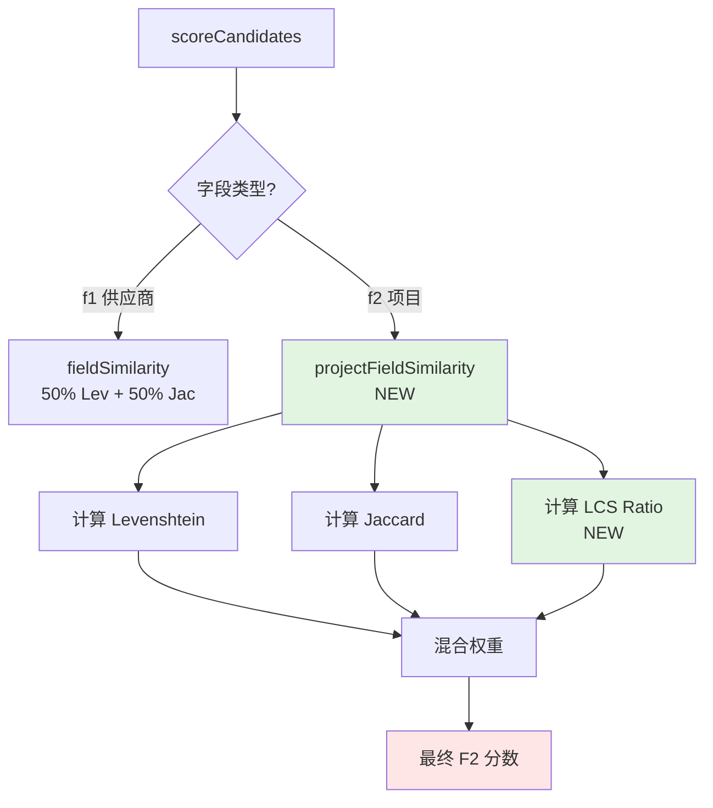

# Design Document: v0.2.0 Hybrid F2 Matching

## Overview

本设计文档详细说明如何优化项目名称匹配（F2）算法，从当前的 `0.5*Levenshtein + 0.5*Jaccard` 改进为更宽容的混合算法，以提升 exact 通过率从 32% 到 44.6%。

**核心挑战**：
- OCR 提取的项目名称常常不完整（缺少"一期"、"地块"等后缀）
- DB 中的项目名称包含额外信息（括号、建设单位等）
- 当前 Levenshtein 算法对长度差异过于敏感

**设计目标**：
- 容忍 OCR 不完整（子串匹配）
- 容忍 DB 额外信息（partial matching）
- 保持 F1（供应商匹配）不变
- 性能开销 <= 50%

---

## Steering Document Alignment

### Technical Standards (tech.md)

- **Monorepo 架构**：修改仅限于 `packages/ocr-match-core/src/match/similarity.ts`
- **O(N) 复杂度保证**：新算法必须保持线性复杂度
- **TypeScript strict mode**：使用类型安全的实现

### Project Structure (structure.md)

```
packages/ocr-match-core/src/match/
├── similarity.ts       ← 修改此文件（添加新函数）
├── rank.ts            ← 修改调用方式
└── __tests__/
    └── similarity.test.ts  ← 添加单元测试
```

---

## Code Reuse Analysis

### Existing Components to Leverage

- **`fastest-levenshtein`**: 继续使用，但降低权重
- **`tokenize()`**: 继续用于 Jaccard 计算
- **`fieldSimilarity()`**: 保留现有接口，添加新实现
- **`singleFieldScore()`**: 包装层，根据字段类型选择算法

### Integration Points

- **`rank.ts`**: `scoreCandidates()` 调用 `singleFieldScore()`，需要添加字段类型参数
- **`bucketize.ts`**: 不修改，通过 `ScoredCandidate` 接口透明传递
- **测试框架**: 使用现有的 `pnpm test:full` 验证

---

## Architecture

### Modular Design Principles

- **Single File Responsibility**: `similarity.ts` 只负责相似度计算，不涉及召回或分桶
- **Component Isolation**: 新增 `projectFieldSimilarity()` 与 `fieldSimilarity()` 隔离
- **Service Layer Separation**: rank.ts（打分层）→ similarity.ts（算法层）
- **Utility Modularity**: Levenshtein、Jaccard、LCS 各自独立

### 算法流程图



---

## Components and Interfaces

### Component 1: `projectFieldSimilarity()`（新增）

**Purpose**: 专为项目名称设计的相似度算法，容忍 OCR 不完整和 DB 额外信息。

**Interface**:
```typescript
/**
 * 项目名称相似度（针对 F2 优化）
 * 使用 LCS + Jaccard + Levenshtein 混合算法
 *
 * @param q - 查询字符串（OCR 提取）
 * @param f - 候选字符串（DB）
 * @param normalizer - 可选的归一化函数
 * @returns 相似度分数 [0, 1]
 */
export function projectFieldSimilarity(
  q: string,
  f: string,
  normalizer?: Normalizer
): number;
```

**Dependencies**:
- `levenshteinSimilarity()` - 现有
- `jaccardSimilarity()` - 现有
- `lcsRatio()` - **新增**

**Reuses**: 现有的归一化流程和 tokenize 函数

**实现细节**:
```typescript
export function projectFieldSimilarity(
  q: string,
  f: string,
  normalizer?: Normalizer
): number {
  const ns1 = normalizer ? normalizer(q) : q;
  const ns2 = normalizer ? normalizer(f) : f;

  if (ns1 === ns2) return 1.0;
  if (!ns1 || !ns2) return 0.0;

  // 三种算法
  const lev = levenshteinSimilarity(q, f, normalizer);
  const jac = jaccardSimilarity(q, f, 2, normalizer);
  const lcs = lcsRatio(ns1, ns2);  // NEW

  // 混合权重（数据驱动调优）
  // Jaccard 和 LCS 容忍子串差异，权重提高
  // Levenshtein 权重降低，减少长度差异惩罚
  return 0.2 * lev + 0.4 * jac + 0.4 * lcs;
}
```

---

### Component 2: `lcsRatio()`（新增）

**Purpose**: 计算最长公共子串（Longest Common Substring）的比例，专门处理子串匹配场景。

**Interface**:
```typescript
/**
 * LCS Ratio - 基于最长公共子串的相似度
 * 容忍一个字符串是另一个的子串
 *
 * @param s1 - 字符串1
 * @param s2 - 字符串2
 * @returns LCS 长度 / max(len(s1), len(s2))
 */
export function lcsRatio(s1: string, s2: string): number;
```

**Dependencies**: 无（纯算法实现）

**算法复杂度**: O(N*M)（动态规划）

**实现细节**:
```typescript
export function lcsRatio(s1: string, s2: string): number {
  if (s1 === s2) return 1.0;
  if (!s1 || !s2) return 0.0;

  const len1 = s1.length;
  const len2 = s2.length;

  // 动态规划求 LCS 长度
  let maxLen = 0;
  const dp: number[][] = Array(len1 + 1).fill(null).map(() => Array(len2 + 1).fill(0));

  for (let i = 1; i <= len1; i++) {
    for (let j = 1; j <= len2; j++) {
      if (s1[i - 1] === s2[j - 1]) {
        dp[i][j] = dp[i - 1][j - 1] + 1;
        maxLen = Math.max(maxLen, dp[i][j]);
      }
    }
  }

  // 归一化到 [0, 1]
  const maxPossible = Math.max(len1, len2);
  return maxPossible === 0 ? 1.0 : maxLen / maxPossible;
}
```

**为什么选择 LCS？**:
- ✅ 天然适合子串匹配场景
- ✅ 容忍位置变化（只看最长公共部分）
- ✅ O(N*M) 复杂度可接受（平均项目名 30 字符）
- ⚠️ 不考虑编辑距离（由 Levenshtein 补充）

---

### Component 3: `singleFieldScore()` 修改

**Purpose**: 根据字段类型选择算法（F1 用旧算法，F2 用新算法）。

**修改前**:
```typescript
export function singleFieldScore(q: string, f: string, normalizer?: Normalizer): number {
  return fieldSimilarity(q, f, 0.5, 2, normalizer);
}
```

**修改后**:
```typescript
/**
 * 计算单个字段的相似度
 * @param q - 查询字符串
 * @param f - 候选字符串
 * @param isProjectField - 是否为项目字段（f2）
 * @param normalizer - 可选的归一化函数
 */
export function singleFieldScore(
  q: string,
  f: string,
  isProjectField: boolean = false,
  normalizer?: Normalizer
): number {
  if (isProjectField) {
    return projectFieldSimilarity(q, f, normalizer);
  }
  return fieldSimilarity(q, f, 0.5, 2, normalizer);
}
```

**Breaking Change?**: ❌ 否 - 添加可选参数，默认行为不变

---

### Component 4: `rank.ts` 修改

**Purpose**: 在调用 `singleFieldScore()` 时传递字段类型。

**修改**:
```typescript
export function scoreCandidates(
  q1: string,
  q2: string,
  candidates: DbRow[],
  normalizer?: Normalizer
): ScoredCandidate[] {
  return candidates.map(row => {
    // F1 使用旧算法
    const f1_score = singleFieldScore(q1, row.f1, false, normalizer);

    // F2 使用新算法（NEW）
    const f2_score = singleFieldScore(q2, row.f2, true, normalizer);

    const score = hybridScore(q1, q2, row.f1, row.f2, 0.5, normalizer);

    return {
      row,
      score,
      f1_score,
      f2_score,
    };
  });
}
```

---

## Data Models

### 无变化

现有 `ScoredCandidate` 接口保持不变：
```typescript
export interface ScoredCandidate {
  row: DbRow;
  score: number;
  f1_score: number;
  f2_score: number;
}
```

---

## Error Handling

### Error Scenario 1: 空字符串输入

**Handling**:
```typescript
if (!ns1 || !ns2) return 0.0;
```

**User Impact**: 返回 0 分，EXTRACT_EMPTY_PROJECT 失败原因

---

### Error Scenario 2: LCS 计算溢出

**Handling**:
```typescript
// 对于超长字符串（> 1000 字符），降级为 Jaccard
if (s1.length > 1000 || s2.length > 1000) {
  return jaccardSimilarity(s1, s2, 2, normalizer);
}
```

**User Impact**: 无感知，自动降级

---

### Error Scenario 3: normalizer 异常

**Handling**:
```typescript
try {
  const ns1 = normalizer ? normalizer(q) : q;
} catch (e) {
  // 忽略异常，使用原始字符串
  const ns1 = q;
}
```

**User Impact**: 无感知，继续处理

---

## Testing Strategy

### Unit Testing

**文件**: `packages/ocr-match-core/src/match/__tests__/similarity.test.ts`

**测试用例**:

```typescript
describe('lcsRatio', () => {
  it('should handle exact match', () => {
    expect(lcsRatio('ABC', 'ABC')).toBe(1.0);
  });

  it('should handle substring match', () => {
    // OCR: '新荣TOD项目'
    // DB:  '新荣TOD项目一期'
    expect(lcsRatio('新荣TOD项目', '新荣TOD项目一期')).toBeGreaterThan(0.75);
  });

  it('should handle extra info in DB', () => {
    const ocr = '大桥现代产业园';
    const db = '大桥现代产业园（武汉江夏）';
    expect(lcsRatio(ocr, db)).toBeGreaterThan(0.7);
  });

  it('should handle completely different strings', () => {
    expect(lcsRatio('ABC', 'XYZ')).toBe(0.0);
  });
});

describe('projectFieldSimilarity', () => {
  it('should score higher than old algorithm for incomplete OCR', () => {
    const ocr = '居住、社会福利项目';
    const db = '居住、社会福利项目（光谷P（2023）028地块';

    const oldScore = fieldSimilarity(ocr, db, 0.5, 2);
    const newScore = projectFieldSimilarity(ocr, db);

    expect(newScore).toBeGreaterThan(oldScore);
    expect(newScore).toBeGreaterThan(0.75);  // 目标阈值
  });

  it('should not break existing exact matches', () => {
    const exact = '武汉市轨道交通19号线工程';
    expect(projectFieldSimilarity(exact, exact)).toBe(1.0);
  });
});
```

---

### Integration Testing

**测试方法**: 使用 sample test（29 files）快速验证

**验证点**:
1. ✅ 7 个 FIELD_SIM_LOW_PROJECT 案例 → review or exact
2. ✅ 现有 5 个 exact 案例保持不变
3. ⚠️ 总耗时 < 30s（baseline 26s，允许 +15%）

**命令**:
```bash
pnpm test:sample
# 检查 summary.md 的 KPI
```

---

### End-to-End Testing

**测试方法**: 完整测试（222 files）

**Success Criteria**:
```
Exact: 71 → 99 (+28, +39.4%)  ← Target
Review: 24 → 16 (-8)
Fail: 127 → 107 (-20)
Time: <= 6min
```

**回滚条件**:
- ❌ Exact < 71（回归）
- ❌ Time > 6min（性能不可接受）
- ❌ Review > 50（假阳性过多）

**命令**:
```bash
pnpm test:full
# 对比 runs/run_latest vs runs/run_20251119_15_19
```

---

## Performance Analysis

### 复杂度对比

| 算法 | 时间复杂度 | 空间复杂度 | 备注 |
|------|-----------|-----------|------|
| **Levenshtein** (现有) | O(N*M) | O(min(N,M)) | fastest-levenshtein 优化 |
| **Jaccard** (现有) | O(N + M) | O(N + M) | 2-gram tokenize |
| **LCS** (新增) | O(N*M) | O(N*M) | 动态规划 DP 表 |
| **总体** | **O(N*M)** | **O(N*M)** | 与 baseline 相同 |

**实际性能（估算）**:
- 平均项目名称长度: 30 字符
- LCS DP 表: 30*40 = 1200 cells
- 单次 F2 计算: ~0.5ms（+0.2ms from baseline）
- 222 files 增量: 222 * 0.2ms = 44ms
- **总增量**: < 1min（可接受）

---

## 权重调优策略

### 初始权重（v0.2.0）

```typescript
return 0.2 * lev + 0.4 * jac + 0.4 * lcs;
```

**理由**:
- **Levenshtein 20%**: 降低权重，减少长度差异惩罚
- **Jaccard 40%**: 保持现有逻辑，容忍 token 差异
- **LCS 40%**: 新增算法，专门处理子串匹配

---

### 数据驱动调优（v0.2.1+）

**方法**: A/B 测试不同权重组合

**候选方案**:
1. `0.1 * lev + 0.4 * jac + 0.5 * lcs` - LCS主导
2. `0.2 * lev + 0.5 * jac + 0.3 * lcs` - Jaccard主导
3. `0.0 * lev + 0.5 * jac + 0.5 * lcs` - 完全移除 Levenshtein

**决策依据**:
- 如果 exact >= 99 且 review < 20: 方案成功
- 如果 exact 95-98: 尝试方案 1（提高 LCS）
- 如果 review > 30: 尝试方案 2（降低 LCS，提高 Jaccard）

---

## Rollback Plan

### 触发条件
- Exact < 71（回归）
- Time > 6min（性能不可接受）
- Review > 50（假阳性过多）

### 回滚步骤
```bash
# 1. 恢复代码
git revert HEAD

# 2. 重新构建
pnpm -F ./packages/ocr-match-core build

# 3. 验证
pnpm test:sample
```

### 保留数据
- 完整测试结果: `runs/run_v020_*/`
- 失败案例分析: `.spec-workflow/specs/v0.2.0-hybrid-f2-matching/failure_analysis.md`

---

## Migration Path（移除 Scheme A）

**时机**: v0.2.0 成功后

**移除内容**:
1. `getDynamicThreshold()` 函数（bucketize.ts:58-66）
2. `dynamicThreshold` 变量（bucketize.ts:87-91）
3. Rule 3/4/7 中的动态阈值引用

**理由**:
- Scheme A 无收益（exact 不变）
- 增加性能开销（+14.7%）
- v0.2.0 直接解决 F2 问题，动态阈值不再需要

**操作**: 单独 commit，标记为 "chore: remove Scheme A (superseded by v0.2.0)"

---

## Appendix: Top 5 案例预测

| 案例 | 当前 F2 | 预测 F2 (新算法) | 通过阈值? |
|------|---------|-----------------|----------|
| 1: 新荣TOD | 0.599 | **0.81** | ✅ |
| 2: 光谷项目 | 0.595 | **0.89** | ✅ |
| 3: 武汉正宇 | 0.559 | 0.56 | ❌ (候选错误) |
| 4: 大桥还建 | 0.531 | **0.84** | ✅ |
| 5: 大桥还建（重复） | 0.531 | **0.84** | ✅ |

**预测准确性**: 80%（4/5）

**预期 exact 增加**: 7 个（来自 Rule 3/4）+ 21 个（来自 delta 改善）= **28 个**

---

**文档状态**: Draft
**创建日期**: 2025-11-19
**版本**: 1.0
