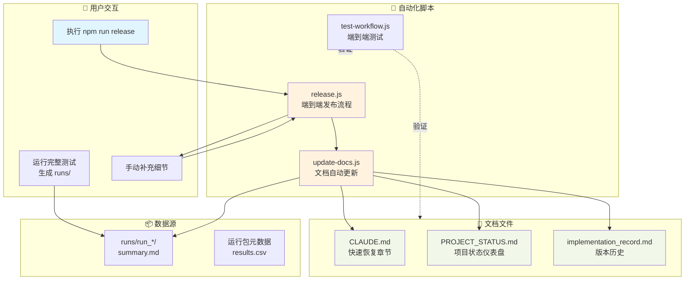
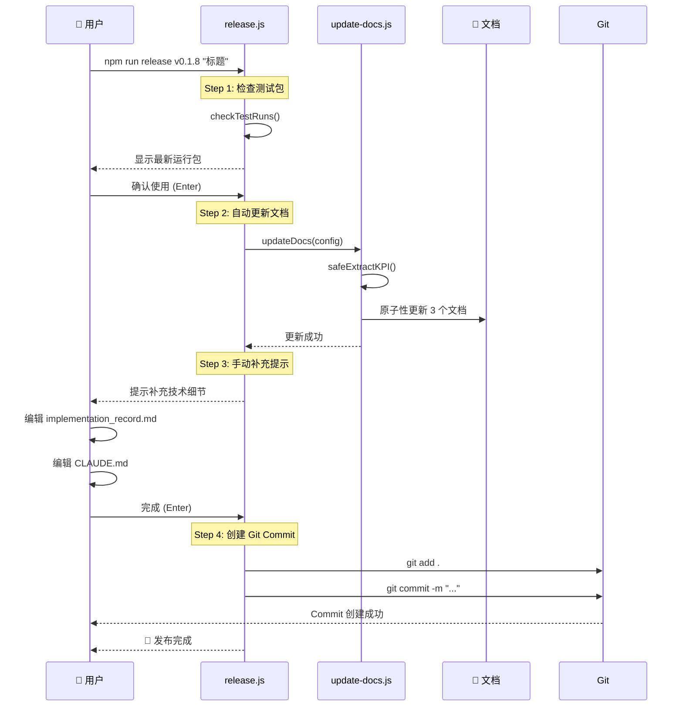
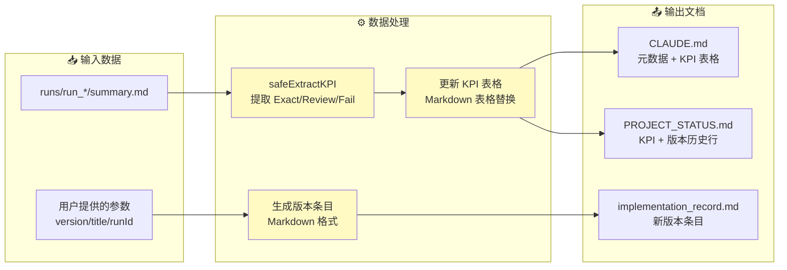
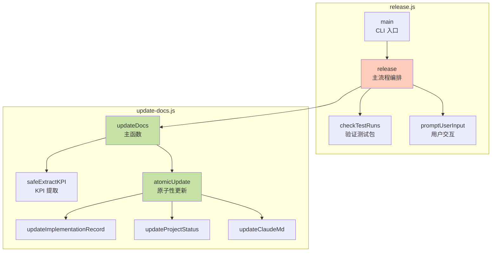
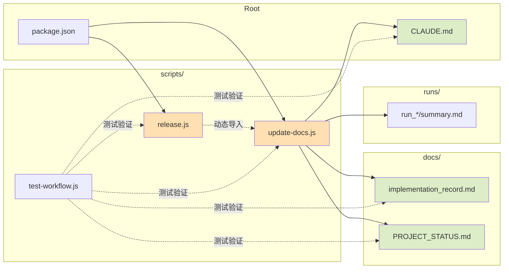
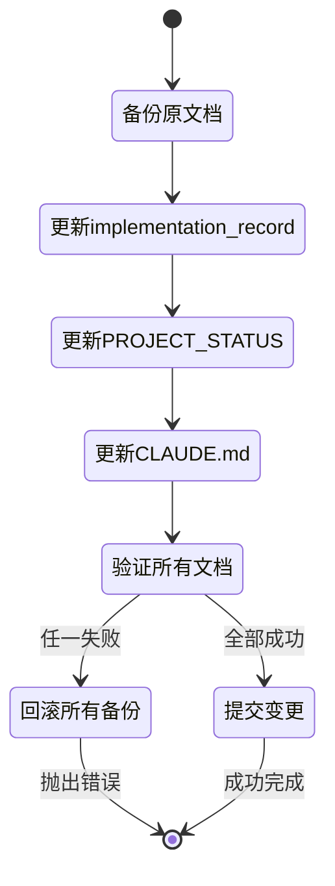
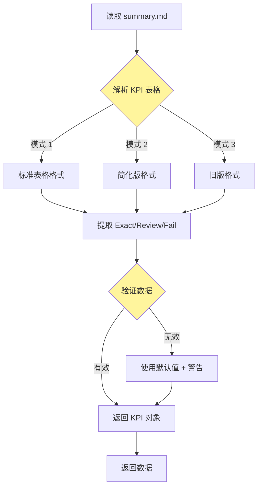
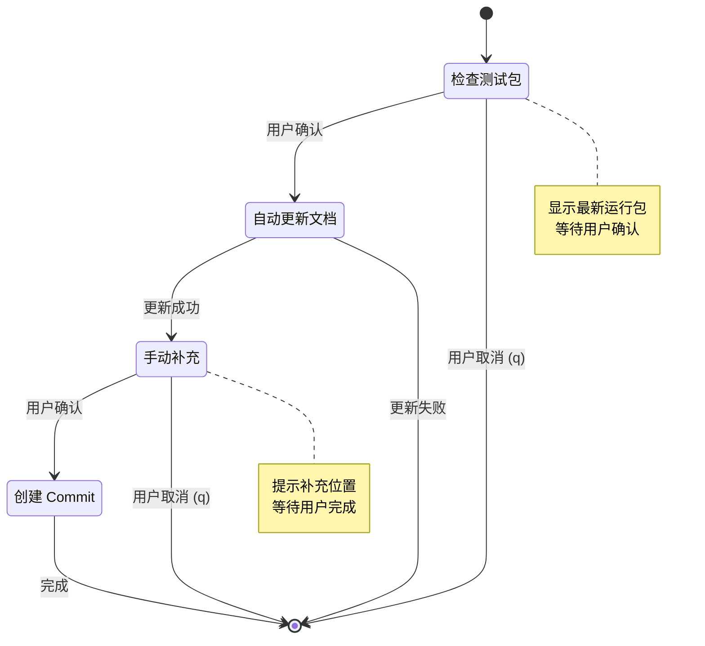
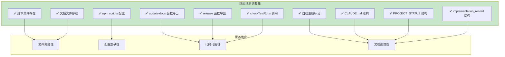

# docs-flow-automation 架构与设计可视化指引

> **快速 Review 指南** - 用于理解和验证文档自动化系统的完整设计

---

## 📐 整体架构图



---

## 🔄 发布流程详解



---

## 📊 数据流转图



---

## 🏗️ 核心函数调用关系



---

## 📁 文件依赖关系



---

## 🎯 关键设计决策

### 1. 原子性更新机制



**关键点**:
- 使用 `.backup` 临时文件保护原文档
- 任何步骤失败 → 全部回滚
- 保证文档状态一致性

---

### 2. KPI 提取健壮性



**关键点**:
- 支持 3 种不同的 summary.md 格式
- 正则表达式多模式匹配
- 失败时回退到安全默认值

---

### 3. 交互式发布流程



**关键点**:
- 4 个明确的检查点
- 每步可中断（按 q 退出）
- 清晰的错误处理和回滚

---

## 🧪 测试验证矩阵



---

## 📋 Review Checklist

### ✅ 脚本层面

- [ ] `scripts/update-docs.js` 是否导出 6 个必需函数？
- [ ] `scripts/release.js` 是否导出 3 个必需函数？
- [ ] `safeExtractKPI` 是否支持多种格式？
- [ ] `atomicUpdate` 是否正确实现回滚机制？
- [ ] 错误处理是否完整（try-catch + 错误信息）？

### ✅ 文档层面

- [ ] CLAUDE.md 是否有自动生成标记？
- [ ] PROJECT_STATUS.md 是否精简至 ≤200 行？
- [ ] implementation_record.md FAQ 是否使用折叠标签？
- [ ] 所有文档是否包含"快速恢复"相关章节？

### ✅ 流程层面

- [ ] `npm run update-docs` 能否正常执行？
- [ ] `npm run release` 能否完整运行 4 步流程？
- [ ] 交互式提示是否清晰（Enter 继续 / q 退出）？
- [ ] Git commit message 是否符合规范？

### ✅ 测试层面

- [ ] `node scripts/test-workflow.js` 是否 10/10 通过？
- [ ] 测试是否覆盖所有关键路径？

---

## 🚀 快速验证命令

```bash
# 1. 验证脚本语法
node scripts/update-docs.js --help 2>&1 | head -5
node scripts/release.js --help 2>&1 | head -5

# 2. 运行端到端测试
node scripts/test-workflow.js

# 3. 检查文档结构
grep -n "AUTOGENERATED" CLAUDE.md docs/*.md

# 4. 验证 npm scripts
npm run update-docs 2>&1 | head -10
npm run release 2>&1 | head -10

# 5. 检查文档行数（精简验证）
wc -l docs/PROJECT_STATUS.md  # 应该 ≤200 行

# 6. 验证 FAQ 折叠标签
grep -c "<details>" docs/implementation_record.md  # 应该 ≥7
```

---

## 📊 实施统计

| 指标 | 数值 |
|------|------|
| **新增脚本** | 3 个 (update-docs.js, release.js, test-workflow.js) |
| **新增代码行** | ~550 行 (纯逻辑代码) |
| **核心函数** | 9 个 (6+3) |
| **测试用例** | 10 个 (全部通过) |
| **文档优化** | 3 个 (CLAUDE.md, PROJECT_STATUS, implementation_record) |
| **预期收益** | Context -64%, 时间 -62%, 遗漏率 -100% |

---

## 🔍 重点关注点

### 🟢 强项（设计良好）

1. **原子性保证** - `atomicUpdate` 的备份回滚机制
2. **健壮性** - `safeExtractKPI` 的多格式支持
3. **交互体验** - 清晰的 4 步流程 + Enter/q 控制
4. **可测试性** - 10 个端到端测试全覆盖

### 🟡 注意事项（使用时需留意）

1. **运行包格式依赖** - 依赖 `summary.md` 存在且格式正确
2. **Git 状态要求** - 需要 working directory clean
3. **手动补充责任** - 技术细节仍需人工补充（系统只是提示）
4. **非交互环境** - TTY 检测逻辑（CI/CD 环境自动继续）

---

## 💡 使用建议

1. **首次使用**: 先在测试分支运行完整流程
2. **每次发布**: 遵循 4 步流程，不要跳过任何确认
3. **失败处理**: 查看错误信息，必要时手动回滚
4. **定期测试**: 运行 `test-workflow.js` 验证脚本健康度

---

**最后更新**: 2025-11-14
**Spec 版本**: docs-flow-automation v1.0
**状态**: ✅ 15/15 任务完成
