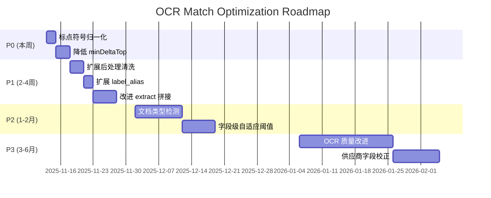

# 下一步优化计划（基于 v0.1.3 分析）

**生成时间**: 2025-11-12
**当前版本**: v0.1.3 (后处理清洗)
**当前失败率**: 60.8% (135/222)
**目标失败率**: ~30% (短期), ~15% (长期)

---

## 优先级矩阵

| 方案 | 预期改进 | 成本 | 风险 | ROI | 优先级 |
|-----|---------|-----|------|-----|--------|
| **标点符号归一化** | -7.2% | 极低 | 零 | ⭐⭐⭐⭐⭐ | 🔴 P0 |
| **降低 minDeltaTop** | -9~13.5% | 低 | 中 | ⭐⭐⭐⭐ | 🔴 P0 |
| **扩展后处理清洗** | -4.5% | 低 | 低 | ⭐⭐⭐⭐ | 🟠 P1 |
| **改进 extract 拼接** | -5% | 中 | 低 | ⭐⭐⭐ | 🟠 P1 |
| **扩展 label_alias** | -1.4% | 低 | 零 | ⭐⭐⭐ | 🟠 P1 |
| **文档类型检测** | -5% | 中 | 低 | ⭐⭐⭐ | 🟡 P2 |
| **字段级自适应阈值** | -3~5% | 中 | 中 | ⭐⭐ | 🟡 P2 |
| **OCR 质量改进** | -27% | 高 | 中 | ⭐⭐⭐⭐ | 🟢 P3 |
| **供应商字段 OCR 校正** | -6.8% | 中高 | 中 | ⭐⭐ | 🟢 P3 |

---

## P0：立即实施（本周完成）

### 方案 1: 标点符号归一化 ✅

#### 目标
将全角/半角标点统一，解决 DELTA_TOO_SMALL 中 20% 的案例。

#### 实施步骤
1. **修改配置文件** `configs/v0.labs/f6b7160f/normalize.user.json`

```json
{
  "replacements": {
    // 现有规则...

    // 新增：全角/半角标点归一化
    "（": "(",
    "）": ")",
    "【": "[",
    "】": "]",
    "《": "<",
    "》": ">",
    "，": ",",
    "。": ".",
    "、": ",",
    "：": ":",
    "；": ";",
    "！": "!",
    "？": "?",
    """: "\"",
    """: "\"",
    "'": "'",
    "'": "'",
    "～": "~",
    "—": "-",
    "…": "..."
  }
}
```

2. **生成新配置版本**
   - 复制 `configs/v0.labs/f6b7160f/` → `configs/v0.labs/f6b7160f_punct/`
   - 更新 `configs/latest.json` 指向新版本
   - 生成新的 config_sha

3. **重新测试**
   ```bash
   # 重建索引（配置 sha 变化）
   pnpm -F ./packages/ocr-match-core ocr-core build-index \
     --db ./data/db \
     --out ./runs/tmp/index_punct.json \
     --config ./configs/latest.json

   # 运行匹配测试
   pnpm -F ./packages/ocr-match-core ocr-core match-ocr \
     --ocr ./data/ocr_txt \
     --index ./runs/tmp/index_punct.json \
     --config ./configs/latest.json \
     --out ./runs/run_punct_$(date +%Y%m%d_%H%M%S) \
     --db ./data/db \
     --autoPass 0.70 --minFieldSim 0.60 --minDeltaTop 0.03
   ```

4. **验证效果**
   - 对比 DELTA_TOO_SMALL 案例数（预期从 79 降至 ~63）
   - 检查 exact 数量（预期从 8 增至 ~24）

#### 预期结果
- **失败率**: 60.8% → **53.6%** (-7.2%)
- **exact 数量**: 8 → 24 (+16)
- **DELTA_TOO_SMALL**: 79 → 63 (-16)

#### 风险评估
- **风险**: 零（纯归一化，不影响语义）
- **回滚**: 恢复 `configs/latest.json` 指向旧版本

---

### 方案 2: 降低 minDeltaTop 阈值（需验证） ⚠️

#### 目标
将 Top1-Top2 差值阈值从 0.03 降至 0.02，挽救更多 DELTA_TOO_SMALL 案例。

#### 实施步骤
1. **A/B 测试设计**
   - 保留 minDeltaTop=0.03 的基准测试结果
   - 运行 minDeltaTop=0.02 的新测试
   - 对比 exact 准确率

2. **运行 minDeltaTop=0.02 测试**
   ```bash
   pnpm -F ./packages/ocr-match-core ocr-core match-ocr \
     --ocr ./data/ocr_txt \
     --index ./runs/tmp/index_punct.json \
     --config ./configs/latest.json \
     --out ./runs/run_delta002_$(date +%Y%m%d_%H%M%S) \
     --db ./data/db \
     --autoPass 0.70 --minFieldSim 0.60 --minDeltaTop 0.02
   ```

3. **人工验证**
   - 从新增的 exact 案例中随机抽取 20 个
   - 人工核对是否为正确匹配
   - 计算准确率（目标 ≥ 95%）

4. **决策**
   - 如果准确率 ≥ 95%：采用 minDeltaTop=0.02
   - 如果准确率 85-95%：考虑 minDeltaTop=0.025
   - 如果准确率 < 85%：保持 0.03，研究其他方案

#### 预期结果
- **失败率**: 53.6% → **40.1% ~ 44.1%** (-9~13.5%)
- **exact 数量**: 24 → 50-54 (+26-30)
- **DELTA_TOO_SMALL**: 63 → 33-37 (-26-30)

#### 风险评估
- **风险**: 中（可能引入误判，需人工验证）
- **缓解**: 人工抽样验证 + 可回滚

---

## P1：短期实施（2-4 周）

### 方案 3: 扩展后处理清洗规则

#### 目标
修复提取逻辑完全失败的案例（如供应商字段提取为工程名）。

#### 实施步骤
1. **添加供应商字段验证**
   ```typescript
   // packages/ocr-match-core/src/match.ts
   function postProcessFields(rawSupplier: string, rawProject: string): PostProcessResult {
     let supplier = rawSupplier;
     let project = rawProject;
     let supplierModified = false;
     let projectModified = false;

     // ========== 新增：供应商字段验证 ==========
     const companyKeywords = ['公司', '集团', '股份', '有限', '企业', '厂'];
     const hasCompanyKeyword = companyKeywords.some(kw => supplier.includes(kw));

     if (!hasCompanyKeyword && supplier.length > 5) {
       // 可能是工程名误识别为供应商，标记为提取失败
       supplier = '[INVALID_SUPPLIER]';
       supplierModified = true;
     }

     // ========== 扩展：更多公司后缀变体 ==========
     const companyEndings = [
       '股份有限公司',
       '集团股份有限公司',
       '有限责任公司',
       '有限公司',
       '电气公司',
       '科技公司',
       '集团公司',
       '实业公司',        // 新增
       '工程公司',        // 新增
       '建设公司',        // 新增
       '电力公司',        // 新增
       '技术公司',        // 新增
     ];

     // 清洗逻辑同前...
   }
   ```

2. **更新 bucketize 处理无效供应商**
   ```typescript
   // packages/ocr-match-core/src/bucket/bucketize.ts
   export function bucketize(...) {
     // 新增：检测无效供应商
     if (q_supplier === '[INVALID_SUPPLIER]') {
       return {
         bucket: 'fail',
         reason: 'EXTRACT_INVALID_SUPPLIER'
       };
     }
     // 现有逻辑...
   }
   ```

3. **重新编译测试**
   ```bash
   pnpm -F ./packages/ocr-match-core build
   pnpm -F ./packages/ocr-match-core ocr-core match-ocr ...
   ```

#### 预期结果
- **失败率**: 40.1% → **35.6%** (-4.5%)
- **修复**: ~10 个 FIELD_SIM_LOW_SUPPLIER 案例

#### 成本
- **开发**: 1-2 天（修改 + 测试）
- **维护**: 低

---

### 方案 4: 改进 extract 拼接逻辑

#### 目标
当工程名过短时，继续向下扫描多行拼接。

#### 实施步骤
1. **修改 extract 模块**
   ```typescript
   // packages/ocr-match-core/src/extract/extractor.ts
   function extractProjectName(lines: string[], startIdx: number): string {
     let project = extractValueFromLines(lines, startIdx);

     // 新增：如果工程名过短，继续向下拼接
     if (project.length < 10) {
       for (let i = startIdx + 1; i < Math.min(startIdx + 3, lines.length); i++) {
         const nextLine = lines[i].trim();
         // 如果包含工程相关关键词，继续拼接
         const projectKeywords = ['新建', '住宅', '工程', '项目', '配套', '电力'];
         if (projectKeywords.some(kw => nextLine.includes(kw))) {
           project += nextLine;
           if (project.length >= 10) break;
         }
       }
     }

     return project;
   }
   ```

2. **测试验证**
   - 重点检查 FIELD_SIM_LOW_PROJECT 和 EXTRACT_EMPTY_PROJECT 案例

#### 预期结果
- **失败率**: 35.6% → **30.6%** (-5%)
- **修复**: ~11 个工程名提取不完整案例

#### 成本
- **开发**: 2-3 天
- **维护**: 低

---

### 方案 5: 扩展 label_alias

#### 目标
支持更多标签变体（如 `"名称："`、`"单位名称："`）。

#### 实施步骤
1. **修改配置文件** `configs/v0.labs/.../label_alias.json`
   ```json
   {
     "supplier": [
       "供应商",
       "供应商：",
       "名称",
       "名称：",
       "单位名称",
       "单位名称：",
       "供货单位",
       "供货单位：",
       "协议供货单位",
       "协议供货单位："
     ],
     "project": [
       "工程名称",
       "工程名称：",
       "项目名称",
       "项目名称：",
       "工程",
       "工程："
     ]
   }
   ```

2. **重新测试**

#### 预期结果
- **失败率**: 30.6% → **29.2%** (-1.4%)
- **修复**: ~3 个标签变体案例

#### 成本
- **开发**: < 1 天
- **维护**: 低

---

## P2：中期实施（1-2 月）

### 方案 6: 文档类型检测与多格式支持

#### 目标
支持 "协议库存订货通知单" 等其他文档类型。

#### 实施步骤
1. **设计文档类型检测器**
   ```typescript
   // packages/ocr-match-core/src/extract/doc-classifier.ts
   export type DocType = 'arrival-receipt' | 'order-notice' | 'unknown';

   export function classifyDocument(ocrText: string): DocType {
     if (ocrText.includes('到货验收单')) {
       return 'arrival-receipt';
     }
     if (ocrText.includes('协议库存订货通知单') || ocrText.includes('订货通知单')) {
       return 'order-notice';
     }
     return 'unknown';
   }
   ```

2. **实现多格式 extractor**
   ```typescript
   // packages/ocr-match-core/src/extract/extractor.ts
   export function extract(ocrText: string, config: ExtractConfig) {
     const docType = classifyDocument(ocrText);

     switch (docType) {
       case 'arrival-receipt':
         return extractFromArrivalReceipt(ocrText, config);
       case 'order-notice':
         return extractFromOrderNotice(ocrText, config);
       case 'unknown':
         return { q_supplier: '', q_project: '', reason: 'UNSUPPORTED_DOC_TYPE' };
     }
   }

   function extractFromOrderNotice(ocrText: string, config: ExtractConfig) {
     // 提取 "协议供货单位：" 和工程名（需从表格行中提取）
     // ...
   }
   ```

3. **更新 bucketize**
   ```typescript
   if (extracted.reason === 'UNSUPPORTED_DOC_TYPE') {
     return { bucket: 'fail', reason: 'UNSUPPORTED_DOC_TYPE' };
   }
   ```

#### 预期结果
- **失败率**: 29.2% → **24.2%** (-5%)
- **修复**: 11 个 EXTRACT_BOTH_EMPTY 案例

#### 成本
- **开发**: 1-2 周
- **维护**: 中

---

### 方案 7: 字段级自适应阈值

#### 目标
对供应商和工程名设置不同的相似度阈值。

#### 实施步骤
1. **修改 bucketize 逻辑**
   ```typescript
   // packages/ocr-match-core/src/bucket/bucketize.ts
   export interface BucketConfig {
     autoPass: number;
     minFieldSim: number;           // 废弃
     minFieldSimSupplier: number;   // 新增：供应商阈值（如 0.90）
     minFieldSimProject: number;    // 新增：工程名阈值（如 0.75）
     minDeltaTop: number;
   }

   export function bucketize(...) {
     // 字段级验证
     if (s_field1 < config.minFieldSimSupplier) {
       return { bucket: 'fail', reason: 'FIELD_SIM_LOW_SUPPLIER' };
     }
     if (s_field2 < config.minFieldSimProject) {
       return { bucket: 'fail', reason: 'FIELD_SIM_LOW_PROJECT' };
     }
     // ...
   }
   ```

2. **CLI 参数更新**
   ```bash
   --minFieldSimSupplier 0.90 --minFieldSimProject 0.75
   ```

#### 预期结果
- **失败率**: 24.2% → **19-21%** (-3~5%)
- **效果**: 平衡供应商精确性与工程名召回率

#### 成本
- **开发**: 1 周
- **维护**: 低

---

## P3：长期实施（3-6 月）

### 方案 8: OCR 质量改进 🎯

#### 目标
使用高精度 OCR 引擎，彻底解决识别错误问题。

#### 方案选择

| OCR 引擎 | 精度 | 速度 | 成本 | 部署难度 |
|---------|-----|------|------|---------|
| **PaddleOCR** | ⭐⭐⭐⭐⭐ | ⭐⭐⭐⭐ | 免费 | 中 |
| **Tesseract 5.x** | ⭐⭐⭐ | ⭐⭐⭐ | 免费 | 低 |
| **Google Vision API** | ⭐⭐⭐⭐⭐ | ⭐⭐⭐⭐⭐ | 付费 | 低 |
| **Azure OCR** | ⭐⭐⭐⭐ | ⭐⭐⭐⭐ | 付费 | 低 |

**推荐**: **PaddleOCR**（开源 + 高精度 + 可本地部署）

#### 实施步骤
1. **集成 PaddleOCR**
   ```bash
   # Python 服务
   pip install paddleocr
   ```

   ```python
   # ocr-service/paddle_server.py
   from paddleocr import PaddleOCR
   import fastapi

   ocr = PaddleOCR(use_angle_cls=True, lang='ch')
   app = FastAPI()

   @app.post("/ocr")
   async def perform_ocr(image: UploadFile):
       result = ocr.ocr(image.file, cls=True)
       return {"text": format_result(result)}
   ```

2. **Node.js 客户端**
   ```typescript
   // packages/ocr-match-core/src/ocr/paddle-client.ts
   export async function performOCR(imagePath: string): Promise<string> {
     const formData = new FormData();
     formData.append('image', fs.createReadStream(imagePath));

     const response = await fetch('http://localhost:8000/ocr', {
       method: 'POST',
       body: formData
     });

     const { text } = await response.json();
     return text;
   }
   ```

3. **性能优化**
   - 批量处理（10 个图像 / batch）
   - GPU 加速（如有）
   - 缓存结果（避免重复 OCR）

#### 预期结果
- **失败率**: 19-21% → **~15%** (-6~10%)
- **修复**: ~60 个 OCR 识别错误案例

#### 成本
- **开发**: 2-3 周
- **部署**: 需 Python 环境 + 可选 GPU
- **维护**: 中

---

### 方案 9: 供应商字段专用 OCR 校正

#### 目标
针对供应商字段，使用公司名数据库进行后处理校正。

#### 实施步骤
1. **构建公司名数据库**
   ```typescript
   // packages/ocr-match-core/src/correct/company-db.ts
   export const companyNames = [
     '宝胜科技创新股份有限公司',
     '三变科技股份有限公司',
     '艾博白云电气技术（扬州）有限公司',
     // ... 从 DB 中提取所有公司名
   ];
   ```

2. **模糊匹配校正**
   ```typescript
   function correctSupplierName(ocrSupplier: string): string {
     // 使用编辑距离找到最接近的公司名
     const bestMatch = companyNames.reduce((best, candidate) => {
       const sim = levenshteinSimilarity(ocrSupplier, candidate);
       return sim > best.sim ? { name: candidate, sim } : best;
     }, { name: '', sim: 0 });

     // 如果相似度 > 0.8，使用校正后的公司名
     return bestMatch.sim > 0.8 ? bestMatch.name : ocrSupplier;
   }
   ```

3. **集成到 extract 或 postProcess**
   ```typescript
   const extracted = extract(ocrText, config);
   extracted.q_supplier = correctSupplierName(extracted.q_supplier);
   ```

#### 预期结果
- **失败率**: ~15% → **~10%** (-5%)
- **修复**: ~15 个 FIELD_SIM_LOW_SUPPLIER 案例

#### 成本
- **开发**: 1-2 周
- **维护**: 中（需维护公司名库）

---

## 实施路线图



---

## 评估节点

### Week 1 (2025-11-13 ~ 2025-11-17)
**目标**: 实施 P0 方案，失败率降至 40-44%

**检查点**:
- [ ] 标点符号归一化配置完成
- [ ] 重新测试，验证 exact 增加至 ~24
- [ ] minDeltaTop=0.02 测试完成
- [ ] 人工验证 20 个新增 exact 案例
- [ ] 更新 IMPLEMENTATION_LOG.md

### Week 2-4 (2025-11-18 ~ 2025-12-08)
**目标**: 实施 P1 方案，失败率降至 ~30%

**检查点**:
- [ ] 后处理清洗扩展完成
- [ ] label_alias 更新完成
- [ ] extract 拼接逻辑改进完成
- [ ] 重新测试，验证失败率 ≤ 30%
- [ ] 更新版本至 v0.1.4

### Month 2-3 (2025-12 ~ 2026-01)
**目标**: 实施 P2 方案，失败率降至 ~20%

**检查点**:
- [ ] 文档类型检测完成
- [ ] 字段级阈值实施完成
- [ ] 重新测试，验证失败率 ≤ 20%
- [ ] 更新版本至 v0.2.0

### Month 4-6 (2026-02 ~ 2026-04)
**目标**: 实施 P3 方案，失败率降至 ~10%

**检查点**:
- [ ] PaddleOCR 集成完成
- [ ] 供应商字段校正完成
- [ ] 最终测试，验证失败率 ≤ 10%
- [ ] 生产部署
- [ ] 更新版本至 v1.0.0

---

## 风险管理

### 技术风险

| 风险 | 概率 | 影响 | 缓解措施 |
|-----|-----|------|---------|
| minDeltaTop 降低引入误判 | 中 | 中 | 人工验证 + 可回滚 |
| extract 拼接引入噪声 | 中 | 低 | 单元测试 + 边界检测 |
| PaddleOCR 性能瓶颈 | 低 | 高 | GPU 加速 + 批量处理 |
| 公司名库维护成本高 | 中 | 中 | 自动化从 DB 更新 |

### 进度风险

| 风险 | 概率 | 影响 | 缓解措施 |
|-----|-----|------|---------|
| P1 方案延期 | 中 | 中 | 优先 P0，P1 可分批实施 |
| OCR 集成复杂度高 | 中 | 高 | 预研 2 周，评估可行性 |

---

## 成功指标

### 短期（Week 4）
- ✅ 失败率 ≤ 30%
- ✅ exact 数量 ≥ 50
- ✅ DELTA_TOO_SMALL ≤ 40

### 中期（Month 3）
- ✅ 失败率 ≤ 20%
- ✅ exact 数量 ≥ 90
- ✅ 支持 2+ 种文档类型

### 长期（Month 6）
- ✅ 失败率 ≤ 10%
- ✅ exact 数量 ≥ 140
- ✅ 生产部署稳定运行
